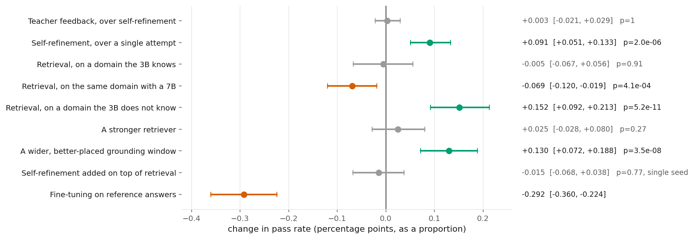
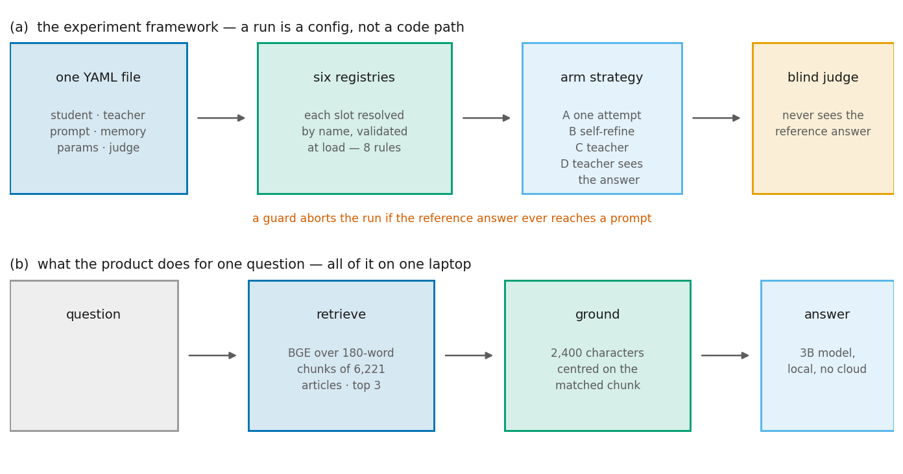
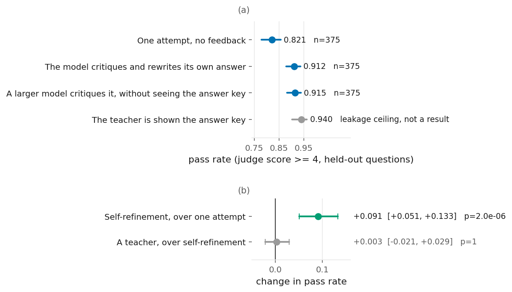
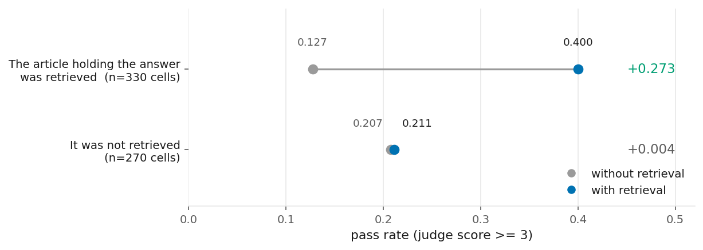
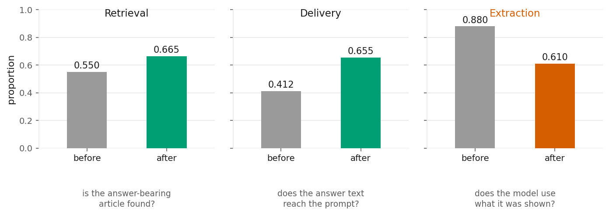
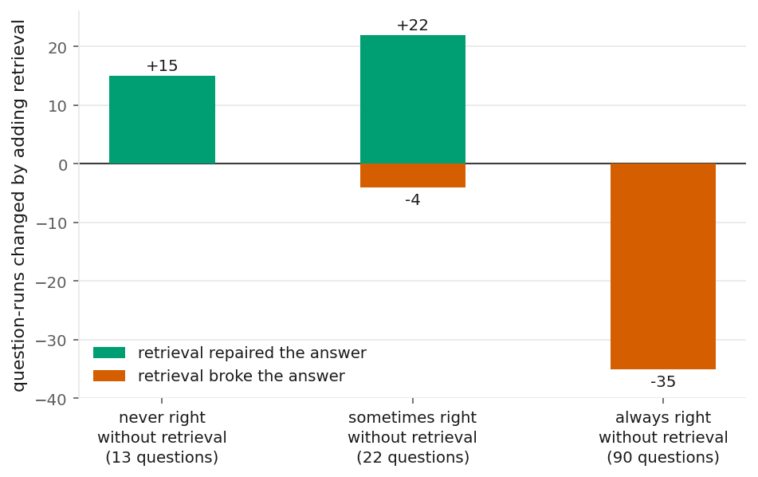

# Teaching Lightweight LLMs

**What actually makes a small local language model better at one specialised domain — and what only
looks like it does.**

A 3-billion-parameter model runs on an ordinary laptop, keeps every document private, and costs
nothing per query. It is also noticeably worse at specialised questions than a model twenty times
its size. Three things are widely assumed to close that gap: have a larger model teach it, give it
retrieval over the domain's documents, fine-tune it on domain answers.

This project measured all three on held-out data, with the reference answer kept structurally out of
the evaluation. **Nine interventions were tried. Two worked** — and the largest single gain came
from somewhere nobody had predicted.

> ⚠️ **An earlier version of this repository reported 25% → 83%, and 100% with "ground-truth
> memory".** Its own audit found those were artefacts of the reference answer leaking into the
> evaluation, and of a score that was 70% resemblance rather than correctness. They are retired.
> How that happened, and how it was found, is [§3 and §4 of the experiment record](docs/EXPERIMENT_RESULTS.md#3-the-original-system-and-what-it-claimed)
> — it is the most useful part of this project, not the part to skip.

<picture>
  <source media="(prefers-color-scheme: dark)" srcset="reports/figures/fig-01-all-interventions-measured-dark.png">
  
</picture>

*Each point is the change in held-out pass rate with a 95% paired cluster-bootstrap interval.
Colour is applied only where the interval clears zero — grey means inconclusive, and is not dressed
up as a result.*

### The four findings

| | |
|---|---|
| **An independent teacher in the loop adds nothing.** | +0.003 [−0.021, +0.029], p = 1.00. The model re-reading and rewriting its own answer is the part that worked (+0.091). |
| **Retrieval helps if and only if the retrieved text contains the answer.** | −0.005 where the model already knew the domain; **+0.152** where it did not. Split one run by whether the right document was actually retrieved: **+0.273** when it was, +0.004 when it was not. |
| **How retrieved text is delivered mattered ~5× more than which retriever found it.** | +0.130 from changing which 2,400 characters reach the prompt, against +0.025 from a better retriever — at zero inference cost. |
| **Fine-tuning on reference answers actively hurt.** | −0.292. The fine-tune worked; it learned the reference corpus's terse style, and terse answers fail a bar that requires completeness. |

**And the unsolved one:** every intervention here helps deficient answers and taxes adequate ones.
Applied selectively they are all clearly positive — but a 3B model cannot tell which case it is in.
It called its own answer complete 59% of the time, including when it was wrong. Two independent
experiments, months apart, reached that conclusion. **The missing component is a reliable gate, not
a better intervention.**

---

## Contents

- [What was built](#what-was-built)
- [Results](#results)
- [How this was measured](#how-this-was-measured)
- [Install and run](#install-and-run)
- [Reproduce any number](#reproduce-any-number)
- [Repository map](#repository-map)

---

## What was built

<picture>
  <source media="(prefers-color-scheme: dark)" srcset="reports/figures/fig-02-system-architecture-dark.png">
  
</picture>

Two things. **An experiment framework** where one run is one YAML file: six slots — which model
answers, which critiques, which prompt, whether retrieval is attached, the loop parameters and seed,
and which judge scores it — each resolved through a registry and validated by eight rules at load
time. Two of those rules exist because of the failure this project is built around: the judge must
come from a different model family than the student, and a baseline arm may not accumulate memory.
A third guard inspects every prompt and aborts the run if the reference answer appears in it.

**And the product those experiments point at**: retrieve over a local index, choose which part of
the retrieved text to show, answer with a 3B model. Everything but the judge runs on one laptop.

---

## Results

Every number is computed from a committed run log, on held-out questions, with a pre-registered
statistic. Figures regenerate from those same logs — no number in them is typed by hand, and
[a test asserts each one still matches what the documents claim](tests/tlw/figures/test_published_numbers.py).

### 1. Does a teacher-student loop teach a small model?

*MedQuAD, 125 held-out questions × 3 seeds, student `qwen2.5:3b`, blind judge, pass = score ≥ 4*

| arm | pass rate | effect | verdict |
|---|---|---|---|
| one attempt, no feedback | 0.821 | — | |
| self-refinement | 0.912 | **+0.091** [+0.051, +0.133], p < 0.0001 | ✅ real |
| independent teacher on top | 0.915 | **+0.003** [−0.021, +0.029], p = 1.00 | ❌ nothing |
| *teacher sees the answer key* | *0.940* | *leakage ceiling, not a result* | ⚠️ |

<picture>
  <source media="(prefers-color-scheme: dark)" srcset="reports/figures/fig-04-medquad-teaching-loop-ablation-dark.png">
  
</picture>

A 70B model was being paid to add three thousandths of a point. The teacher was dropped.

### 2. Does retrieval help?

| testbed | why it was chosen | 3B alone | + retrieval | effect |
|---|---|---|---|---|
| **MedQuAD** (medical QA) | the model already knows this | 0.821 | 0.816 | **−0.005** [−0.067, +0.056] — no effect |
| **WixQA** (one company's support docs) | the model has *no* knowledge of it | 0.163 | 0.315 | **+0.152** [+0.092, +0.213], p = 5e-11 |

On the same medical testbed retrieval **significantly harms a 7B**: −0.069 [−0.120, −0.019],
p = 0.0004. The stronger the model, the fewer gaps retrieval can fill and the more its distraction
costs. Three rescue attempts were run before accepting the null — a better reranker, a 24× larger
corpus, a more detailed prompt (**single seed each**, so directional). All three came in below the
unaided baseline.

The cleanest evidence is a split of a single run. Hold model, prompt, judge and pass bar fixed;
separate the questions only by whether the article containing the answer was actually retrieved:

<picture>
  <source media="(prefers-color-scheme: dark)" srcset="reports/figures/fig-10-wixqa-rag-gold-split-dark.png">
  
</picture>

### 3. What actually gates it

| system | pass rate | what changed |
|---|---|---|
| no retrieval | 0.163 | — |
| + retrieval | 0.315 | retrieval added |
| + a better retriever | 0.340 | **+0.025** [−0.028, +0.080] — not significant |
| **+ a wider, better-placed window** | **0.470** | **+0.130** [+0.072, +0.188], p = 3.5e-08 — *only the prompt construction changed* |
| + self-refinement on top | *not measured on this set* | **−0.015** [−0.068, +0.038] on the gold-retrieved subset, one seed — no benefit |

The system was showing the first 900 characters of each retrieved article, and the median article is
3,555 — so 92.5% were cut and only 41% of the expert answer's content survived. Centring the window
on the chunk the retriever had already matched uses localisation the system was computing and
throwing away.

Fixing that exposed a third stage, which got *worse*: with nearly twice as much answer material in
front of it, the model used a smaller share — 88% → 61%.

<picture>
  <source media="(prefers-color-scheme: dark)" srcset="reports/figures/fig-14-rag-pipeline-stage-analysis-dark.png">
  
</picture>

### 4. Does fine-tuning help?

**No: −0.292** [−0.360, −0.224]. QLoRA on 506 (question, reference answer) pairs, 23 minutes on a
laptop GPU, evaluated with the adapter on and off on the same stack. Training was healthy — the
fine-tune worked, learned the reference corpus's terse style, and answers became 30–45% shorter.
Shorter answers fail a bar that requires completeness.

### 5. The pattern underneath all of it

Retrieval, a wider context window and self-refinement each **helped deficient answers and taxed
adequate ones.** On MedQuAD the two halves were almost exactly equal, which is what a null of
−0.005 is made of:

<picture>
  <source media="(prefers-color-scheme: dark)" srcset="reports/figures/fig-08-medquad-rag-outcome-split-dark.png">
  
</picture>

Applied selectively, every one of them is clearly positive. The model cannot make that call itself.

**→ [The full experiment record](docs/EXPERIMENT_RESULTS.md)** — objectives, every decision and why,
all 17 figures, all 21 tables, 26 null results, and the six guardrails that caught something.

---

## How this was measured

| | |
|---|---|
| **Repetition** | 3 seeds for every headline; pilots and single-seed runs labelled as such everywhere |
| **Interval on a difference** | paired cluster bootstrap over questions, 10,000 resamples, RNG seeded so every regeneration is identical |
| **Significance** | exact binomial McNemar on the discordant pairs |
| **Leakage** | the student never sees the reference; a guard aborts the run if it appears in a prompt. It fired once, on the arm designed to leak |
| **The judge** | a different model family from the student, enforced at config load. **Both candidates failed their calibration probe** — so the pass bar was raised, one judge was held fixed across all arms, and the limitation is stated wherever the numbers appear |
| **Honesty** | 26 null results have [their own table](reports/tables/tab-15-null-results.md) (Table 15); two wrong predictions have [another](reports/tables/tab-16-predictions-vs-outcomes.md) (Table 16) |

---

## Install and run

**Requirements:** Python 3.11+, [Ollama](https://ollama.com) for the local model, ~8GB VRAM for the
optional fine-tune. A Groq free-tier key is needed only to re-run judging.

```bash
git clone <this-repo> && cd Teaching-light-weight-llm-based-project
conda env create -f environment.yml
conda activate tlw          # every `python` below means this environment's interpreter
ollama pull qwen2.5:3b
```

> Every command in this README assumes `tlw` is active. Nothing here hardcodes an interpreter path —
> that was a real defect in this repository once (thirteen scripts pinned to one developer's home
> directory, so the headline results could not run from a clone) and it is
> [recorded as such](reports/tables/tab-19-methodology-and-integrity.md) (Table 19).

Rebuild the artifacts a clone does not carry (indexes and third-party data are gitignored):

```bash
python scripts/dataset/fetch_wixqa.py
python -m tools.rag.cli
```

Run one experiment — the seed is the run's identity and comes from the environment, so one config
drives all its pre-registered seeds:

```bash
EXPERIMENT_PARAMS_SEED=42 python run.py --config experiments/teaching-loop/1-baseline.yml
```

## Reproduce any number

Nothing below needs a GPU, an API key, or a model run.

```bash
python scripts/make_figures.py
```

Regenerates all 17 figures (light and dark) and all 21 tables from the committed logs.

```bash
python -m pytest tests/ -q
```

401 tests, including a suite that recomputes each published headline from its artifact and fails if
a figure and a document ever disagree.

```bash
python -m src.tlw.analysis --runs-dir runs/teaching-loop-medquad --comparison C-B --comparison B-A
python -m src.tlw.analysis --runs-dir runs/rag-medquad --rag
python scripts/wixqa/analyze_three_seeds.py
python scripts/wixqa/analyze_dose_response.py
```

## Repository map

```
run.py                     the entrypoint:  run.py --config experiments/<study>/<condition>.yml
config/                    authored configuration — base.yml holds every default
experiments/               one YAML per run condition, grouped by the study it belongs to
data/                      inputs only; raw MedQuAD is immutable, clean/ is the pipeline product
src/tlw/                   the config-driven core — config · registries · memory · prompts ·
                           evaluation · loop · analysis · figures · runner
scripts/                   thin drivers; each imports from src/ or tools/
tools/                     reusable CLI utilities — dataset cleaner, readiness assessor, index builder
runs/                      experiment artifacts, grouped by the question each study answers
reports/                   the committed evidence: figures, tables, analysis printouts
docs/                      EXPERIMENT_RESULTS.md, per-study reports, archive/
tests/                     mirrors src/ and tools/
.claude/rules/             the project's own rules and its full decision log
```

| looking for | go to |
|---|---|
| the whole story with every number | [docs/EXPERIMENT_RESULTS.md](docs/EXPERIMENT_RESULTS.md) |
| every figure with its caption | [reports/figures/README.md](reports/figures/README.md) |
| every measured value, including the nulls | [reports/tables/](reports/tables/) |
| per-study protocol and limitations | [docs/](docs/) |
| why anything is the way it is | [reports/tables/tab-20-decision-log.md](reports/tables/tab-20-decision-log.md) (Table 20) |

---

## Data and licence

MedQuAD — Ben Abacha & Demner-Fushman, *BMC Bioinformatics* 2019, CC BY 4.0.
WixQA — Cohen et al. 2025, [arXiv:2505.08643](https://arxiv.org/abs/2505.08643), MIT.
Built with Llama.
