# Teaching Lightweight LLMs — an experiment report

**What makes a small local language model better at one specialised domain — and what only looks
like it does.**

---

## Abstract

A small business that wants a question-answering assistant over its own documents cannot send them
to a hosted model and cannot afford per-token costs at volume. A 3-billion-parameter model runs on
an ordinary laptop for nothing, and is noticeably worse at specialised questions than a model twenty
times its size. Three interventions are widely assumed to close that gap: an iterative teacher-student
loop, retrieval over the domain's documents, and fine-tuning on domain answers.

This report measures all three on one small model, on two testbeds chosen to differ in whether the
model already knows the domain, with the reference answer kept structurally out of the evaluation
path. Nine interventions were measured; **two worked**. Iterative self-refinement gained
**+0.091 [+0.051, +0.133]**, while adding an independent larger teacher on top of it gained
**+0.003 [−0.021, +0.029]** — nothing. Retrieval was worth **−0.005 [−0.067, +0.056]** where the
model already knew the domain and **+0.152 [+0.092, +0.213]** where it did not, and the difference
is attributable, within a single run, to whether the retrieved text contained the answer. The
largest single gain was not planned: changing *which part* of a correctly retrieved document reached
the prompt was worth **+0.130 [+0.072, +0.188]**, five times the effect of a better retriever and
without an extra model call. Fine-tuning on reference answers cost **−0.292 [−0.360, −0.224]**.

An earlier version of this project reported a rise from 25% to 83%, and 100% with a memory of
reference answers. Those results are retracted here, and the retraction is reported as a result:
re-analysis of the original system's own logs shows a headline that was a function of a threshold
the experimenter chose, a score of which 70% rewarded resemblance to the reference rather than
correctness, and eighteen paths by which the answer could reach the model being measured.

**Everything below is recomputed from committed logs.** Nothing is transcribed by hand, and a test
suite fails if a figure and this document ever disagree.

---

## How to read this

**Every number here is recomputed from a committed log.** Figures and tables regenerate with
`python scripts/make_figures.py`, and `tests/tlw/figures/test_published_numbers.py` recomputes each
published headline from its artifact and fails if a document and a log ever disagree. Three
content-overlap values are read from committed analysis printouts rather than recomputed; they are
labelled where they appear. Nothing else is typed by hand.

**Differences carry intervals, and colour follows the interval.** Every effect is reported as a
change in held-out pass rate with a 95% paired cluster-bootstrap interval over questions (10,000
resamples, seeded at 0) and an exact McNemar test. Where an interval spans zero, the result is drawn
in grey and called inconclusive — not rounded up into a finding.

**Negative results are results.** [Twenty-six of them](../reports/tables/tab-15-null-results.md)
(Table 15) have their own table. Three are hypotheses this project raised and then falsified with
its own data; two are cases where a well-supported published method did not transfer to this scale.

**Two pass bars appear and they are not interchangeable.** On the medical testbed a pass means the
judge scored the answer 4 — "correct *and* complete". On the support-documentation testbed it means
3 — "correct". The reason is in §5.5, and the two testbeds are read as separate studies that share
an axis of *change*, which is the only thing comparable between them.

---

## Contents

| | |
|---|---|
| [1. Purpose and scope](#1-purpose-and-scope) | the problem, the thesis, what is out of scope |
| [2. Objectives, success criteria, and the rules fixed before each run](#2-objectives-success-criteria-and-the-rules-fixed-before-each-run) | seven questions and how each would be settled |
| [3. How this report is built](#3-how-this-report-is-built) | the reporting standard followed, and the provenance rule |
| [4. What the literature predicts](#4-what-the-literature-predicts) | stated before the measurements, not after |
| [5. Method](#5-method) | design, materials, system, conditions, instrument, leakage control, analysis, compute |
| [6. Chronology](#6-chronology) | the order things actually happened, which is not the intuitive one |
| [7. Results](#7-results) | Study 0 — the retracted original — through Study 7 |
| [8. General discussion](#8-general-discussion) | the law, the recurring pattern, and the literature reconciled |
| [9. Implications for building](#9-implications-for-building) | seven recommendations |
| [10. Limitations](#10-limitations) | what these numbers cannot support |
| [11. What broke in the project itself](#11-what-broke-in-the-project-itself) | seven failures of its own credibility |
| [12. How the work was governed](#12-how-the-work-was-governed) | and where the working documents went |
| [13. Reproduction and appendices](#13-reproduction-and-appendices) | commands and where everything lives |
| [14. Contribution and tool use](#14-contribution-and-tool-use) | who did what, and how AI tooling was used |

---

## 1. Purpose and scope

### 1.1 The problem

A small business wants a question-answering assistant over its own domain — support documentation,
internal procedures, a specialist field. It cannot send that material to a hosted model, cannot
afford per-token costs at volume, and has no ML team. A 3-billion-parameter model runs on an
ordinary laptop for nothing and keeps every document local. It is also noticeably worse at
specialised questions than a model twenty times its size.

**So: what closes that gap, and by how much?** Three things are widely assumed to. Have a larger
model teach the smaller one. Give it retrieval over the domain's documents. Fine-tune it on domain
answers. Each has strong published support. None of them had been measured, together, on one small
model, with the reference answer kept out of the evaluation.

### 1.2 The thesis under test

> Fine-tuning teaches a model *how to say things*; retrieval teaches it *what is true*; an iterative
> teacher-student loop is a way of generating training data and evaluating, not a thing you ship.

That framing comes from the superficial alignment hypothesis [[3](#references)] and was adopted
early ([ADR-003](../reports/tables/tab-20-decision-log.md), Table 20). Most of what follows is that
thesis being tested rather than assumed — including the parts of it that turned out to be wrong at
this scale.

### 1.3 What is out of scope

- **Model pre-training and architecture.** Every model here is used as published.
- **Serving, latency and concurrency.** Costs are reported (§5.8) but the work is not a deployment
  study.
- **Generalisation beyond two domains.** Two testbeds are used deliberately, and the limits of what
  two can support are stated in §10.
- **Human evaluation.** Correctness is scored by a model judge whose own validation failed, which is
  reported as a limitation rather than worked around (§5.5).

---

## 2. Objectives, success criteria, and the rules fixed before each run

### 2.1 The questions

Seven, grouped as the reporting standard requires — primary questions the design was built to
answer, secondary questions it was extended to answer, and exploratory findings that arrived
unplanned and are labelled as such rather than promoted.

| | Question | Study | Class |
|---|---|---|---|
| **O1** | Does an iterative teacher-student loop teach a small model, over and above the model simply re-reading its own answer? | 1 | primary |
| **O2** | Does retrieval help a model that already knows the domain? | 2 | primary |
| **O3** | Does retrieval help *reliability* on the hard tail rather than the average? | 3 | secondary |
| **O4** | Does retrieval help when the model genuinely lacks the knowledge? | 4 | primary |
| **O5** | What gates retrieval — the retriever, or something downstream of it? | 5 | secondary; the delivery finding within it is **exploratory** |
| **O6** | Does the loop compound with retrieval — the system this project is named after? | 6 | primary |
| **O7** | Does fine-tuning on domain answers help? | 7 | primary |

**O5's largest result was not planned.** The dose-response study was designed to test the retriever.
The delivery finding — that a correctly retrieved document was being truncated before the model saw
the answer — came from an audit run *before* the next experiment, and turned out to be five times
larger than the effect the study was built to measure. It is reported as exploratory, because that
is what it is, and because a finding of that size arriving unplanned is worth being honest about.

### 2.2 The rules fixed before each run

Three studies had their claim, statistic and stopping condition written down before the run. They
are quoted here rather than paraphrased, because a paraphrase of a pre-registration is not one. The
full documents are in [`docs/protocol/`](protocol/README.md), with a register that states plainly
what version control can and cannot corroborate about their dates.

**Study 1 — the loop.** From the teaching-loop protocol, §4.3:

> Track-A loop effect = pass_rate(C) − pass_rate(B), reported with a 95% paired-bootstrap CI over
> the 125 held-out questions, pooled across 3 seeds; McNemar p-value alongside; A = baseline floor,
> D = leakage ceiling (labeled, not a result).

The choice that matters is the comparator. Measuring the loop against *no attempt at all* would have
credited the teacher with the gain from the model re-reading its own answer. Arm B exists so that
the teacher has to earn its own effect.

**Study 2 — retrieval on a known domain.** From the RAG protocol, §6:

> RAG effect = pass_rate(3B+RAG) − pass_rate(3B), reported with a 95% paired cluster-bootstrap CI
> over the 125 held-out questions (cluster = question, seeds pooled, ≥10,000 resamples), exact
> McNemar p-value alongside, Wilson per-arm descriptive — the identical machinery Track A used.
> […] `faithfulness` and `reference_match` are reported but are **NOT** the claim.

**Study 6 — the loop on top of retrieval.** From the grounding-and-loop plan, §6, a table of
observations and the conclusion each would license. The row that fired:

> | Stage-2 lift < +2pt or CI spans 0 | self-refine does **not** compound here | ship single-pass RAG; spend the compute on a bigger base model |

The pilot returned −0.015 with an interval spanning zero. The three-seed run was therefore not
executed, and Study 6 is reported as a single-seed pilot — a weaker result than the alternative, and
the reason it is weaker is a rule written before the data arrived.

### 2.3 What "fixed in advance" can and cannot claim here

Version control cannot corroborate the dates. The directory holding these protocols was untracked
until 2026-08-07, so most of them entered git after the runs they govern; the register prints
*written*, *first in git* and *ran* side by side rather than smoothing that over.

What is checkable is the consequence of having written them:

- **Two predictions recorded in them came out wrong**, and are published as wrong
  ([Table 16](../reports/tables/tab-16-predictions-vs-outcomes.md)). The grounding repair was
  predicted at about 0.36 and returned 0.470; refinement was predicted at +3 points and returned
  −1.5, the sign flipped.
- **One stop rule fired and cost a result**, as above.
- **One prediction was right for a stated reason** — a mixture of two measured conditional rates
  forecast 0.337 before the run, which returned 0.340.

A protocol written after the fact does not contain forecasts that embarrass its author, and does not
stop its author from collecting the data they wanted.

**And where a protocol was not followed, that is on its face rather than in this paragraph.** The
teaching-loop protocol departed from its own specification in three ways, each recorded as a dated
amendment on the document itself and summarised in the register's *Followed?* column: the pass bar
was raised from score ≥ 3 to ≥ 4 after the pilot showed every arm passing on the first round; the
judge-calibration gate failed and the run proceeded anyway with one judge held fixed; and the
student model changed from 7B to 3B. The first of those is a threshold changed after seeing data,
which is exactly the move this report criticises in its own retracted predecessor
([§7.0](#70-study-0--the-original-system-re-analysed-against-its-own-logs)) — the difference is that here it is
declared, applied identically to all four arms, and the comparison it feeds is a difference rather
than a level.

### 2.4 What would have counted as success

- An intervention "works" if its 95% interval on held-out data excludes zero.
- The loop's value is specifically **arm C minus arm B**, as above.
- Retrieval's value is measured on two testbeds chosen to differ in one property: whether the model
  already knows the domain.

---

## 3. How this report is built

### 3.1 The standard followed

The structure is IMRaD as codified by the APA Journal Article Reporting Standards for quantitative
research [[30](#references)] — purpose, objectives with their pre-stated criteria, method, results,
discussion, limitations — extended for computational work by the machine-learning reproducibility
checklist [[31](#references)], which is where §5.7's seeds and resampling counts, §5.8's compute, and
§13's artifact index come from. Three of that standard's requirements do real work here: a method
section separate from the results, hypotheses grouped as primary, secondary and exploratory (§2.1),
and an explicit statement of registration status (§2.3).

Figures and tables follow APA 7 numbering with message-first captions [[28](#references)], and
differences are drawn as position on a common scale rather than as bars, because position is the
more accurately read encoding [[29](#references)].

### 3.2 The honesty rules this project set itself

Two, written down before the rebuild and enforced in code rather than by intention:

- **Every reported number must match its source log.** Weak results are reported plainly.
- **The model being measured never sees the reference answer.** A teacher may read it to generate
  feedback; a store may not hand it back to the student. §5.6 describes how that line is held.

### 3.3 Provenance

Every value in this report is recomputed from `runs/`, `reports/` or the immutable
`logs/experiments/` by `src/tlw/figures/`, and `tests/tlw/figures/test_published_numbers.py`
asserts that each drawn value still equals what this document publishes. The previous version of the
figure script read no run logs at all — every number in it was typed from a prose document — which
is why that test exists.

---

## 4. What the literature predicts

Stated here, before the measurements, so that §8.3 can reconcile them afterwards rather than
selecting the ones that agree.

**Retrieval should beat fine-tuning for injecting knowledge.** Ovadia et al. [[2](#references)]
compare the two directly and find retrieval the stronger route for facts the model does not have.
Prediction: retrieval helps where there is a knowledge gap; fine-tuning does not add knowledge.

**Fine-tuning should transfer style rather than knowledge.** The superficial alignment hypothesis
[[3](#references)] holds that alignment tuning teaches format and voice, with knowledge acquired in
pre-training. Prediction: a fine-tune on domain answers changes how the model writes.

**Iterative self-critique should improve outputs.** Self-Refine [[4](#references)] reports gains from
a model critiquing and rewriting its own work, and Reflexion [[12](#references)] extends the idea to
agents that keep a verbal record of their own mistakes. Against them, Huang et al.
[[5](#references)] argue that models cannot reliably self-correct when they must supply their own
correctness signal. Prediction: contested — and the disagreement is itself testable at 3B scale.

**Retrieval should help unevenly, and can hurt.** Mallen et al. [[6](#references)] find retrieval
helps on long-tail facts and hurts on ones the model already knows, and recommend retrieving
adaptively. Irrelevant retrieved context degrades generation [[7](#references), [8](#references)],
and models use long contexts unevenly, with material in the middle used least [[9](#references)].
Prediction: a net effect near zero on a domain the model knows, hiding two opposing effects.

**Models are poorly calibrated about their own knowledge.** Kadavath et al. [[10](#references)] and
Xiong et al. [[11](#references)] find self-reported confidence unreliable. Prediction: a gate built
on the model's own uncertainty will not work.
---

## 5. Method

### 5.1 Design

**Two testbeds, chosen to differ in one property.** Every finding about retrieval in this report
turns on whether the model already knows the domain, so that property is the design variable rather
than an afterthought.

| | MedQuAD | WixQA |
|---|---|---|
| what it is | consumer-health questions and answers from twelve NIH sites | one company's customer-support knowledge base |
| size used | 125 held-out questions, corpus of 414 indexed passages | 200 expert-written questions over 6,221 help-centre articles |
| the 3B unaided | **0.821** | **0.163** |
| what it therefore tests | whether an intervention helps a model near its ceiling | whether an intervention helps a model with a real gap |
| pass bar | judge score ≥ 4, "correct and complete" | judge score ≥ 3, "correct" |

The bars differ for a reason given in §5.5, and the consequence is that **absolute pass rates are
never compared across the two**. Only the *change* an intervention produces is comparable, which is
what §7.4 does.

**The loop ablation is four arms on the same questions and seeds**, differing in one thing each:

| arm | between-round feedback | teacher sees the reference? | role |
|---|---|---|---|
| **A** | none — a single attempt | — | the floor |
| **B** | the model critiques and rewrites its own answer | no | the loop without a teacher |
| **C** | a larger model critiques it | no | **the treatment** |
| **D** | a larger model critiques it | **yes** | leakage ceiling — labelled, never a result |

Arm D exists to show how far a leak can inflate a score, and is drawn in grey wherever it appears.

**The retrieval studies are single-pass** (`arm A`, one round) so that retrieval is the only variable
— the loop questions were already settled by Study 1. The MedQuAD retrieval study crosses two model
sizes with retrieval on and off; the WixQA studies form a ladder in which each rung contains the one
before it: no retrieval → retrieval → better retriever → wider grounding window.

**Seeds.** Three per condition — {13, 42, 123} — with the student at temperature 0.3, so that seeds
are genuinely different draws rather than reruns of the same one. Seeds are supplied per invocation
through the environment, not written into the configuration file, so one file drives all three.

### 5.2 Materials

**Table 2.** [*MedQuAD Dataset Report*](../reports/tables/tab-02-medquad-dataset-report.md) — where
the data came from and what cleaning removed

<picture>
  <source media="(prefers-color-scheme: dark)" srcset="../reports/figures/fig-03-medquad-cleaning-yield-dark.png">
  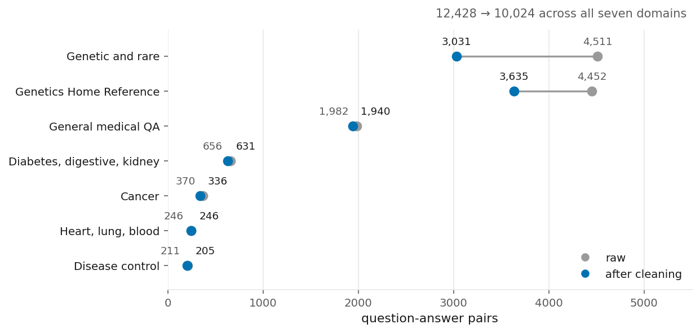
</picture>

MedQuAD [[21](#references)], CC BY 4.0: 47,457 question-answer pairs auto-extracted from twelve NIH
websites — which is why the raw text carries boilerplate, referral phone numbers and duplicated
template answers. **12,428 pairs in, 10,024 out.** On the domain the experiments used, residual noise
went from 1.4% to zero, three duplicate answers to zero, thirty-two malformed questions were repaired
and twenty-two answers were dropped as too short to be answerable. The near-duplicate threshold
follows the deduplication literature [[23](#references)]; the readiness rubric's complexity, quality
and diversity axes follow DEITA [[24](#references)].

The split is **506 train / 125 held-out**, disjoint. The retrieval corpus is built from the train
side only and the held-out side is never indexed.

This stage is reported like a result because the previous version's score was 70% resemblance to
these answers, and a noisy reference makes such a score a measurement of the noise.

WixQA [[22](#references)], MIT: 200 expert-written question-answer pairs over 6,221 real help-centre
articles. **No anti-leak scrub is applied to this corpus, and that is correct rather than an
oversight**: the knowledge base is the legitimate source a support assistant would read, and the
expert answers were themselves written from it. What is never indexed is the 200 expert answers.

**Sources:** `data/clean/*_report.json` · `data/clean/*_readiness_rag.json` ·
`indexes/wixqa-help-centre/manifest.json`.

### 5.3 The system

**Table 20.** [*Decision Log*](../reports/tables/tab-20-decision-log.md) — every decision with its
date

<picture>
  <source media="(prefers-color-scheme: dark)" srcset="../reports/figures/fig-02-system-architecture-dark.png">
  
</picture>

One run is one YAML file. Six slots — which model answers, which model critiques, which prompt,
whether retrieval or memory is attached, the loop parameters and seed, and which judge scores it —
each resolved through a registry by name and validated by eight rules when the configuration loads.
The fully merged configuration is written into the run's own output, so a number can always be traced
back to the exact settings that produced it.

Two of those validation rules exist because of the failure in §7.0: **the judge must come from a
different model family than the student**, and **a baseline arm may not accumulate memory**. Both are
enforced at load, not by convention.

The memory store was redesigned to hold a *coaching note* rather than an answer, with a store-time
tripwire — exact substring, a twelve-token shingle, and cosine similarity — that rejects any note
containing the reference. Red-teamed against the thirty-two leaked records from the old store, it
rejects all of them.

**Retrieval** [[1](#references)] is a read-only backend behind the same interface as the memory
store, which is why adding it required no change to the runner. Articles are embedded and searched
with FAISS; the retrieved passages enter the *first* answer attempt as labelled background rather
than as an answer.
The retriever that the WixQA ladder settled on chunks articles into 180-word windows before embedding
and uses BGE [[13](#references)] rather than MiniLM.

**Sources:** `src/tlw/` · `config/base.yml` · the layout in `.claude/rules/structure.md`.

### 5.4 Conditions and prompts

The prompt catalogue that the rebuild inherited had accumulated **42 authored variants** — thirteen
student prompts, twenty-three teacher prompts, six judge prompts — of which most had never been used
twice. They were curated down to **seven named presets** resolved through a registry, so that a
condition names a prompt rather than embedding one.

The teacher style was chosen on evidence rather than preference. Reading the original project's own
phase-2 log, the three feedback styles it compared scored **0.90, 0.50 and 0.40**; the strongest was
adopted. That comparison is also one of the retracted numbers — the retired write-up published it as
90 / 85 / 80 — and the conclusion it supported was later overturned anyway, when a properly powered
re-test found the elaborate student prompt indistinguishable from the minimal one (0.840 vs 0.864,
p = 0.58, §7.2).

**Two prompt templates are quarantined by name at load time**, and a test asserts they stay that way:
the student template that rendered `COPY THIS EXACTLY: {ground_truth}`, and the teacher template that
instructed the teacher to end its critique with `Example: {ground_truth}`. Loading a prompt file
containing either raises rather than warns.

### 5.5 The instrument, and the pass bar

**Table 17.** [*Judge Calibration Probes*](../reports/tables/tab-17-judge-calibration-probes.md) —
the judge calibration probes

Correctness is scored by a model judge that never sees the reference answer on the MedQuAD testbed,
and sees it only to score — never in the student's path — on WixQA, where a closed-domain answer
cannot be judged without it. The judge is always from a different model family than the student,
enforced at configuration load.

Each candidate judge was shown forty answers per class: correct ones, plainly wrong ones, truncated
ones, and a deliberately adversarial class altered to be subtly wrong while still reading well. A
usable judge passes the first, fails the second and fourth, and agrees with a stronger reference
judge.

**Neither candidate passed.** One waved through 92.5% of the deliberately-wrong answers; the other,
95%. A stricter rubric was tried and made things worse — the judge began rejecting good answers, its
pass rate on correct answers falling from 0.975 to 0.25.

What was done about it is the part worth reading. The pass bar was raised, and **one judge was held
fixed across every arm** so that comparisons between arms remain valid even where absolute levels do
not. The limitation is restated in §10. Retuning the probe until it passed was tried once, recorded,
and rejected.

**Choosing the pass bar.** At "correct", all four arms of the loop ablation sit between 0.99 and 1.00
and are indistinguishable — an ablation run at that bar would have returned a null *by construction*
rather than by evidence, because there was no room left to improve. Raising the bar to "correct and
complete" restores about eighteen points of headroom.

Note what this is: the same dial the original project turned downward (§7.0), turned upward. The
difference is direction and disclosure — the bar was fixed before the comparison and its cost is
stated. On WixQA the strict bar is structurally unreachable, because the full source article contains
only about 72% of the expert answer's content, so that testbed is scored at "correct".

Two diagnostics are computed and **never merged into the pass decision**: similarity to the reference
answer, and — on retrieval runs — how well the answer is grounded in the passages it was shown, after
RAGAS [[14](#references)]. Both are reported in their own columns. Keeping them separate is what makes §7.1's central observation
visible at all.

### 5.6 Leakage control

**Table 5.** [*Leakage Audit*](../reports/tables/tab-05-leakage-audit.md) — eighteen paths and six
seals · **[full audit](LEAKAGE_AUDIT.md)**

The rule: a model may be *taught* using the reference answer but never *shown* it while being
measured. So a teacher reading the answer is legal, and a memory store handing that answer back to
the student is not.

Six mechanisms hold that line, each structural rather than procedural:

| | |
|---|---|
| **1** | `assert_gt_free` inspects every prompt on the framework's answering path — the arm shown the reference, and every retrieval run — before the model is called, and **aborts the run** rather than logging a warning. The WixQA study answers outside this path and is sealed by seal #7 instead |
| **2** | the memory tripwire in §5.3 — three independent checks, red-teamed at 100% rejection |
| **3** | the two leaking prompt templates are quarantined by name at load (§5.4) |
| **4** | the entire legacy implementation was deleted, so there is no configuration flag left to flip |
| **5** | judge family ≠ student family, enforced at configuration load |
| **6** | seeded historical memory stores are denied by a path denylist |

Retrieval needed three more. The corpus is built from the training split only, then scrubbed twice:
**506 records → 448** after dropping near-duplicates of held-out answers, **→ 414** after dropping
template twins, which share verbatim blocks with a held-out answer while sitting well below the
cosine threshold that would have caught them. At run time any surviving passage that still shares a
twelve-token span with the held-out answer is dropped **and counted**, so the filter's own activity
is reportable rather than silent — thirty passages were dropped across the MedQuAD retrieval run.

**The guard has fired.** One run of arm D — the arm designed to leak — was aborted when the sighted
teacher echoed a twelve-token span of the reference into its feedback. That run is reported as
aborted rather than quietly rerun, which is why arm D has two seeds where every other arm has three.

### 5.7 Analysis

| | |
|---|---|
| **Level** (a pass rate) | Wilson score interval [[25](#references)] |
| **Difference** (an effect) | paired cluster bootstrap over questions, cluster = question, seeds pooled, **10,000 resamples, RNG seeded at 0** [[27](#references)] |
| **Significance** | exact binomial McNemar on the discordant pairs [[26](#references)] |
| **Unit** | a (question, seed) cell; 125 questions × 3 seeds = 375 per MedQuAD arm, 200 × 3 = 600 per WixQA rung |

Clustering on the question rather than the cell is the choice that matters: the three seeds of one
question are not independent observations, and treating them as if they were would produce intervals
about a third too narrow.

**The bootstrap interval is the primary statistic; the McNemar p-value is secondary, and here is
why.** McNemar's test assumes each discordant pair is an independent observation. The pairs here are
(question, seed) cells, so each question contributes up to three of them, and correlated pairs
counted as independent inflate the effective sample size. The p-values are therefore
**anti-conservative** — smaller than a correctly clustered test would give. The direction of that
bias is known and it is stated rather than corrected: a clustered variant exists [[32](#references)],
but the bootstrap interval already accounts for the clustering, and every conclusion in this report
is drawn from the interval. Where the two disagree, the interval is what stands. Nothing here rests
on a p-value near a threshold — the effects that are called real have intervals excluding zero by a
wide margin, and the ones called null have intervals straddling it.

**The bootstrap is deterministic, and an earlier draft of this section said something false about
it.** It claimed that a published interval differing in the third decimal from a recomputed one was
resampling noise. It was not. Both paths run 10,000 resamples from a PCG64 generator seeded at 0 and
return the same answer every time; the two differed because the generator draws cluster *indices*, so
the order the questions are laid out in decides which ones each resample picks — and two callers
keyed the same questions as `"12"` and as `12`, which `sorted()` orders lexically in one case and
numerically in the other. Identical data, identical seed, two intervals. The point estimate never
moved, because it does not depend on order, which is exactly why nothing noticed: every check in
place was on point estimates.

Two published intervals had drifted this way and are corrected: retrieval on the support-documentation
testbed is **[+0.092, +0.213]** and a better retriever is **[−0.028, +0.080]** — the values the
commands in §13 now return. The bootstrap orders clusters by `str(key)` regardless of the key's type,
so the two paths cannot disagree again; the drift test asserts five published intervals as well as
their point estimates, and asserts directly that the key's type cannot change the answer. This was
found by an external review, and it is recorded here rather than quietly repaired because the
mechanism — a check that watched the statistic nobody could break — is more useful than the
0.002 it cost.

**Pilots are structurally separated from headline runs.** They live one directory level deeper than
the run discovery function scans, so no analysis command can pool a pilot into a headline result.
That is a guarantee rather than a convention, and it exists because pooling once happened (§11).

### 5.8 Compute and cost

**Table 18.** [*Compute and Cost*](../reports/tables/tab-18-compute-and-cost.md) — what the whole
project consumed

Everything that constitutes the product runs locally: the 3B and 7B students on Ollama, the
embedding model, the FAISS index, and the QLoRA fine-tune — 23 minutes on an 8 GB laptop GPU. The
only hosted component is **the judge**, which is the measuring instrument, not the product. A
deployment of what this report recommends needs no API key.

---

## 6. Chronology

**Table 21.** [*Project Timeline*](../reports/tables/tab-21-project-timeline.md) — the dated
timeline, generated by merging timestamps inside the run logs with the dates on the decision log

**Sources:** `logs/experiments/phase*/summary.jsonl` · `runs/**/summary.jsonl` ·
`.claude/rules/decisions.md`.

The intuitive order is wrong here, in a way that flatters the early work. Every natural account of a
project like this runs *collect data → clean it → run experiments*. The dates say otherwise:

| | |
|---|---|
| **2025-11-29** | all seven original experiment phases ran, in a single day |
| **2026-07-10** | the audit found the results invalid (ADR-001) |
| **2026-07-12** | the dataset was *identified* as MedQuAD, licence-checked, and the cleaning tool was designed (ADR-005, ADR-006) |

Seven and a half months separate the experiments from the data work, and two days separate the audit
from it. So the original runs used an unidentified medical question-answer dump, with **no held-out
split**, no licence recorded, and no measurement of how noisy the reference answers were.

That ordering is not a footnote. It changes what §5.2 *is*: not preparation, but part of the repair.
And everything the project knows about its data — the twelve NIH sources, the CC BY licence, the
mislabelled directory that turns out to be Genetics Home Reference rather than a growth hormone
receptor — was learned during that repair, not before the experiments that depended on it.
---

## 7. Results

<picture>
  <source media="(prefers-color-scheme: dark)" srcset="../reports/figures/fig-01-all-interventions-measured-dark.png">
  
</picture>

**Table 1.** [*All Interventions Provenance*](../reports/tables/tab-01-all-interventions-provenance.md)
— what each point was measured on

Nine things were tried. Two worked, and the largest single gain came from a third that nobody had
planned to measure.

Each study below reports its question, what was measured, the result with its interval, and what it
means. Study 0 comes first because everything after it was built in response to what it found.

---

### 7.0 Study 0 — the original system, re-analysed against its own logs

**Table 4.** [*V1 Claims vs Logs*](../reports/tables/tab-04-v1-claims-vs-logs.md) — the retraction,
line by line · **[the original design rationale, recovered verbatim](archive/v1-notebook-narrative.md)**

#### The question

The project's first version reported a rise from **25% to 83%**, and **100%** with what it called
"training via memory". Those numbers appeared in this repository's own README until they were
removed. Do they survive re-analysis of the logs they came from?

#### What it was

A teaching loop. The small model answers; a larger model reads the answer and critiques it; the small
model rewrites. Successful teaching episodes are stored in a vector database and retrieved on later
questions. Seven phases built up from a warm-up run to a final validation, and the design of each is
preserved in the archive link above, in the original author's words.

#### What the logs say

| claimed | logged |
|---|---|
| 25% → 83% | **0.33 → 0.84** |
| memory beats no-memory by +5.0 points | **no-memory 0.90, with-memory 0.85** — the sign is reversed |
| teacher styles scored 90 / 85 / 80 | **90 / 50 / 40** |
| student temperature compared at 0.0, 0.3, 0.5 | **only 0.0 and 0.2 were ever run** |
| hard domains: Heart/Lung 70%, Genetic 60% | **neither appears in the logs**; all four that ran scored ≥ 0.80 |
| 920,814 tokens ≈ A$0.50 | **2,956,979 tokens** — one run quoted per phase where a phase had up to twelve; at the project's own quoted rates, **A$1.46–1.98** |
| 100% via ground-truth memory | **true as a number** — and it measures the store returning its own answer key |

Two different failures are mixed in that table, and the second is worse than the first. Some numbers
are inflated relative to their logs. Others describe runs that do not exist.

#### The strongest evidence is the table that reconciles perfectly

<picture>
  <source media="(prefers-color-scheme: dark)" srcset="../reports/figures/fig-06-pass-threshold-sensitivity-dark.png">
  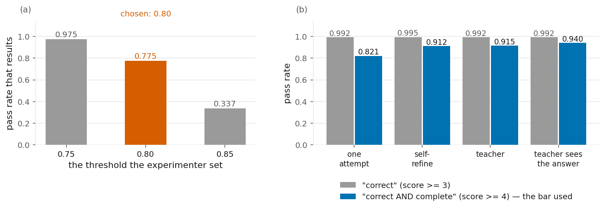
</picture>

The original system's "pass rate" was a composite score compared against a threshold the experimenter
set, and its own hyper-parameter grid records what that setting was worth on identical runs:
**0.975 at the loosest, 0.337 at the strictest**. 0.80 was selected, and the resulting 25% → 83% was
reported as a measured improvement.

Nothing in that grid was miscopied — it is the one table in the retired write-up that matches its logs
exactly. That is precisely what makes it decisive. The headline was a function of a dial the
experimenter turned, not a property of the system.

#### And what the score was actually measuring

<picture>
  <source media="(prefers-color-scheme: dark)" srcset="../reports/figures/fig-05-v1-score-composition-dark.png">
  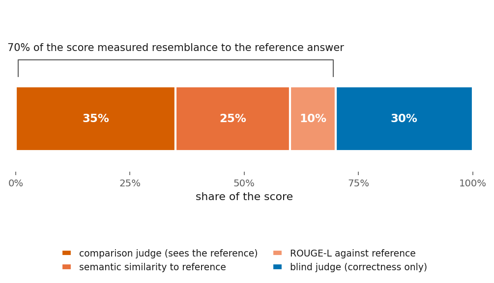
</picture>

Three of the four components compare the answer against the reference text. **70% of the score
rewarded resemblance**, not correctness.

#### How the answer reached the model

Reading the code rather than the results found eighteen paths by which the reference answer could
reach the model being measured. Seven were serious. The three that mattered most:

- **A prompt template that rendered `COPY THIS EXACTLY: {ground_truth}`.** Reachable when the model
  got stuck. Not subtle.
- **Round one of every question retrieved stored feedback into the student's prompt** — with no
  content check, and gated by no configuration flag. Structural.
- **A teacher template instructing the teacher to end its critique with `Example: {ground_truth}`**,
  and that critique went to the student. Confirmed in a production log.

Three of these were switched off by configuration at the time and would have looked clean in any log.
They were found by reading, not by observing a symptom. §5.6 is what closed them.

#### The one worth understanding rather than mocking

The final phase deliberately pre-seeded the memory store with question-and-answer pairs, and the
notebook explains the reasoning in a way worth quoting:

> Similar to an "Open-book Exam" — the Student has correct answers available in Memory. No GPU
> required, no weight updates. Knowledge can be added or removed dynamically at any time.
>
> **Hypothesis:** If Memory contains Ground Truth, the Student should pass from Round 1.

The idea is not absurd. Retrieval-augmented generation *is* a kind of open-book exam, and "no GPU,
knowledge stays editable" is a real advantage — it is close to the system this project eventually
shipped. The error is in what the book contains. An open-book exam where the book is the marked answer
script is not an exam.

And the hypothesis was confirmed exactly as written: the model passed from round one, 100% of the
time. **The confirmation is what should have raised the alarm.** A system that scores 100% has usually
found a way to read the answers.

#### What this study establishes

The retracted numbers are not merely unreliable; they are a measurement of the arrangement that
produced them. Everything from §7.1 onward was run on a rebuilt system in which each of those
arrangements is structurally impossible.

---

### 7.1 Study 1 — does a teacher-student loop teach a small model?

**Table 3.** [*MedQuAD Teaching Loop Results*](../reports/tables/tab-03-medquad-teaching-loop-results.md)
— every value · **Protocol:** [teaching-loop-protocol](protocol/2026-07-13-teaching-loop-protocol.md)
· **Evidence:** [`reports/teaching-loop-medquad/`](../reports/teaching-loop-medquad/)

#### The question

Does an independent, larger teacher critiquing the model's answer beat the model simply re-reading and
rewriting that answer itself? The pre-registered claim is **arm C minus arm B** (§2.2).

#### What was measured

125 held-out MedQuAD questions × 3 seeds × 4 arms = 375 question-runs per arm. Student `qwen2.5:3b`
local; teacher Groq `qwen/qwen3-32b`; judge Groq `llama-3.1-8b-instant`, blind, pass at score ≥ 4.
Memory off in every arm, so the comparison isolates teacher feedback with no cross-question confound.

#### Result

<picture>
  <source media="(prefers-color-scheme: dark)" srcset="../reports/figures/fig-04-medquad-teaching-loop-ablation-dark.png">
  
</picture>

| arm | pass rate | Wilson 95% | seed 13 | seed 42 | seed 123 |
|---|---|---|---|---|---|
| **A** one attempt, no feedback | 0.821 | [0.779, 0.857] | 0.832 | 0.864 | 0.768 |
| **B** the model critiques and rewrites its own answer | 0.912 | [0.879, 0.937] | 0.944 | 0.952 | 0.840 |
| **C** a larger model critiques it, unsighted | 0.915 | [0.882, 0.939] | 0.928 | 0.920 | 0.896 |
| *D the teacher is shown the answer key* | *0.940* | *[0.903, 0.963]* | *0.952* | *0.928* | *— aborted* |

**Self-refinement (B − A): +0.091 [+0.051, +0.133], McNemar p < 0.0001.** Real.
**An independent teacher on top of it (C − B): +0.003 [−0.021, +0.029], p = 1.00.** Nothing —
sixteen questions C won that B lost, fifteen the reverse.

**Source:** `runs/teaching-loop-medquad/` (12 runs, 4 conditions × 3 seeds).

#### What it means

The value was in the model re-reading its own answer, not in the teacher. A 32-billion-parameter model
was being paid to add three thousandths of a point, and it was dropped from every subsequent design.

The loop did engage — arms B, C and D averaged 1.2 to 1.5 rounds against arm A's 1.0, and the teacher
was called 175 times. This is a null from a loop that ran, not from one that never triggered.

Even the leakage ceiling lands at 0.940, about two and a half points above the unsighted teacher.
Showing the model the answer barely moves it, which is further evidence the loop is near its ceiling
once the model self-refines.

#### The diagnostic worth keeping

Similarity to the reference answer stayed flat across all four arms — 0.715, 0.698, 0.691, 0.704 —
while correctness rose nine points. The loop made answers *more correct in the model's own words*, not
more similar to the reference phrasing.

Merging those two into one score is exactly what the original system did (§7.0). It would have hidden
this entire effect, or reported it as slightly negative.

---

### 7.2 Study 2 — does retrieval help a model that already knows the domain?

**Table 6.** [*MedQuAD RAG Results*](../reports/tables/tab-06-medquad-rag-results.md) — every value ·
**Protocol:** [rag-medquad-protocol](protocol/2026-07-16-rag-medquad-protocol.md) ·
**Evidence:** [`reports/rag-medquad/`](../reports/rag-medquad/)

#### The question

Does grounding a model on retrieved passages from its own domain improve its answers, when it already
answers most of them correctly unaided?

#### What was measured

The same 125 held-out questions × 3 seeds, single-pass so retrieval is the only variable, at two model
sizes with retrieval on and off. Identical judge and pass bar to Study 1, which is what makes the two
comparable. Corpus: 414 passages from the training split, scrubbed twice (§5.6).

#### Result

<picture>
  <source media="(prefers-color-scheme: dark)" srcset="../reports/figures/fig-07-medquad-rag-ablation-dark.png">
  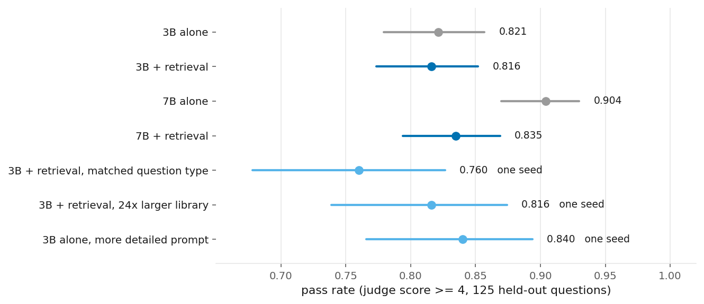
</picture>

**No.** The 3B already answers 82% of these questions unaided.

| comparison | effect | interval | p |
|---|---|---|---|
| retrieval on the 3B | **−0.005** | [−0.067, +0.056] | 0.91 — no effect |
| retrieval on the 7B | **−0.069** | [−0.120, −0.019] | 0.0004 — significantly harmful |
| the 3B with retrieval vs a plain 7B | **−0.088** | [−0.136, −0.043] | — retrieval does not substitute for model size |

That retrieval hurts the *stronger* model more is the mechanism showing through: a better model has
fewer gaps to fill but pays the same distraction tax on the majority it already answers.

Three rescue attempts were run before accepting this, each on one seed and shown in a lighter colour
for that reason: reranking so only passages of the matching question type survive (**0.760**), a corpus
twenty-four times larger (**0.816**), and a more detailed student prompt (**0.840**) — all below the
0.864 unaided baseline on the same seed. The null is structural, not an artefact of a weak retriever
or a small corpus.

A fourth attempt is worth recording because it failed instructively: a "hardened" grounding prompt
telling the model to ignore irrelevant passages **backfired**, dropping a pilot from 0.80 to 0.56. The
3B fixated on passage relevance and prefaced answers with "the passage does not cover this". A small
model cannot reliably follow *use-if-relevant-else-ignore-silently*.

**Sources:** `runs/rag-medquad/` · `runs/rag-medquad-fair-tests/` · `runs/student-prompt-medquad/`.

#### The null is two effects cancelling

<picture>
  <source media="(prefers-color-scheme: dark)" srcset="../reports/figures/fig-08-medquad-rag-outcome-split-dark.png">
  
</picture>

Retrieval repaired 37 answers and broke 39, and the two sets barely overlap. **Not one repair landed
on a question the baseline answered correctly in all three seeds**, and 15 of the 37 landed on
questions it never once answered; in the other direction, **35 of the 39 regressions** landed on
questions it had answered correctly in all three seeds. A retrieved passage that is on-topic but answers a
neighbouring question pulls the model off an answer it already had — the retriever is dominated by the
disease name, so "treatments for X" retrieves "symptoms of X".

"Retrieval did nothing" and "retrieval did two opposite things of equal size" are different facts, and
only the second tells you what to build.

#### Which raises the obvious question

<picture>
  <source media="(prefers-color-scheme: dark)" srcset="../reports/figures/fig-09-selective-gating-bounds-dark.png">
  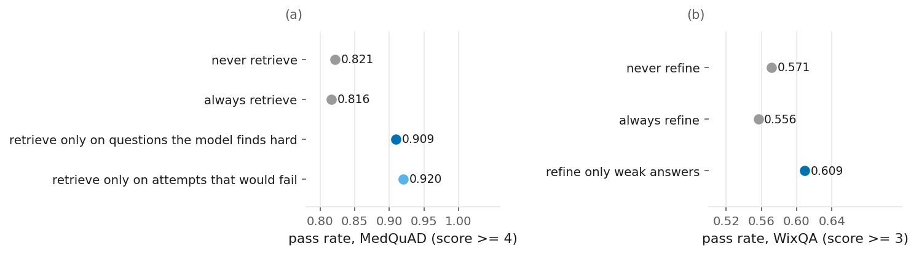
</picture>

Applied only where the model struggles, retrieval is worth **+0.088** (gating per question) to
**+0.099** (gating per attempt, the absolute ceiling). Neither gate is implementable — both need the
outcome they are predicting.

Cheap gates were then tested against the known outcome, and all failed: answer length (precision ~0.35
at any threshold), hedging words (no separation), and cross-seed self-consistency (correlation +0.02,
and non-monotonic — the model is often *confidently* wrong). An LLM asked to judge whether the
passages add anything missing from its own draft was bimodal and useless: 99% fire on a lenient prompt,
0% on a strict one, following the prompt's tone rather than its content.

The gap between the oracle and always-on retrieval is the size of the prize for solving the gating
problem. Hold that thought; it recurs in §7.6 on a completely different intervention.

**Evidence:** [`reports/rag-medquad/selective-gating-analysis.md`](../reports/rag-medquad/selective-gating-analysis.md).

---

### 7.3 Study 3 — does retrieval help reliability rather than the average?

**Table 7.** [*MedQuAD RAG Reliability*](../reports/tables/tab-07-medquad-rag-reliability.md) ·
**Evidence:** [`reports/rag-medquad-reliability/`](../reports/rag-medquad-reliability/)

#### The question

A product answers each question once and must be right — not "right if you resample five times". Study
2 measured the average. Does retrieval improve *dependability*, which is the metric a user actually
experiences?

This is a secondary question, and its set was selected on prior failure, so **only differences are
interpretable, not levels** (§10).

#### What was measured

Two designs. First, a five-seed pilot on two selected subsets — the thirteen questions the baseline
failed in all three original seeds, and a broader hard tail of thirty-five. Then a full sweep over all
125 questions at eight seeds with no selection: four seeds classify each question by how reliably the
unaided model answers it, and the other four measure.

#### Result

On the thirteen genuine knowledge gaps, retrieval raised per-attempt accuracy 0.231 → 0.354. More
usefully: **not one of them was answered correctly on all five attempts without retrieval, and four
were with it.**

That is the product-shaped version of the finding, and it is invisible in the aggregate.

It comes with a cost, and the cost is quoted on a different set from the benefit, so both are named
here. On the broader hard tail of thirty-five, retrieval *lowers* the chance that at least one of five
attempts lands, 0.89 → 0.74. On the thirteen genuine gaps the same measure falls further,
0.692 → 0.385 — more than twice the drop. Both are in **Table 7**. The reason is mechanical: pass@k [[17](#references)] rises with k only when the
samples are diverse, and the same diversity is what makes self-consistency work
[[18](#references)]. Injecting a fixed passage sharply conditions the output distribution, so answers
across seeds collapse toward the passage's framing. Grounding trades exploration for consistency —
bad for a metric that rewards getting lucky once, good for one that requires being right every time.

That second metric is the product-relevant one, and it has a name: this is selective prediction
[[19](#references)], and its question-answering instance [[20](#references)] — a system judged on
dependable correctness, which augments or abstains when it cannot be dependable.

The full sweep, which had no selection bias, sharpens this considerably. Measuring the share of
questions answered correctly on *every* one of four held-out seeds:

| how reliably the model answered it unaided | n | without retrieval | with retrieval | difference |
|---|---|---|---|---|
| never | 33 | 0.098 | 0.053 | −0.045 [−0.129, +0.038] |
| rarely (0–50%) | 20 | 0.300 | 0.150 | −0.150 [−0.338, +0.037] |
| usually (50–99%) | 35 | 0.700 | 0.286 | −0.414 [−0.543, −0.286] |
| always | 37 | 0.946 | 0.405 | −0.541 [−0.655, −0.426] |
| **all 125** | 125 | **0.550** | **0.238** | **−0.312 [−0.384, −0.242]** |

#### What it means

The tug-of-war of §7.2, measured on dependability instead of average correctness, and it is far
larger on this axis. Retrieval devastates the questions the model already answered dependably and is
inconclusive on the ones it never could — the two intervals that span zero are precisely the two
strata where a knowledge gap exists.

So the honest reading is narrower than "retrieval helps reliability". It is: **on questions where the
model has a genuine gap, retrieval converts a few from never-dependable to dependable; everywhere
else it costs dependability, and there are far more questions everywhere else.** That is an argument
for selective application, which returns for the third time in §7.6.

**A note on which numbers are which.** The five-seed pilot and the full sweep measure different sets
with different metrics, and are reported here as two measurements rather than merged into one. The
pilot's per-mechanism analysis was written while the sweep was still running, and the sweep, when it
finished, agreed with its mechanism and was considerably stronger than it suggested.

**And they were not scored by the same judge, which matters more.** The five-seed pilot used the
hosted judge every other MedQuAD study uses; the full sweep — the table above, including
**−0.312 [−0.384, −0.242]**, the largest negative claim about retrieval in this report — was scored
by the *local* `llama3.1:8b`, which **Table 17**,
[*Judge Calibration Probes*](../reports/tables/tab-17-judge-calibration-probes.md), shows is the
**worse** of the two failed candidates: it passes 0.950 of deliberately wrong answers against the
hosted judge's 0.925. One judge is held fixed *within* the sweep, so the four strata and the overall
difference are comparable to each other and the ranking they establish stands. But the sweep's
absolute levels are not comparable to any other number in this report, and a difference measured by
a more permissive instrument is a weaker piece of evidence than the same difference measured by a
stricter one. Verify with:

```bash
python -c "import json,glob; print({json.load(open(f))['eval']['judge']['model'] for f in glob.glob('runs/rag-medquad-reliability/*/config_used.json')})"
```

---

### 7.4 Study 4 — does retrieval help when the model genuinely lacks the knowledge?

**Table 8.** [*WixQA RAG Results*](../reports/tables/tab-08-wixqa-rag-results.md) — every value ·
**Protocol:** [wixqa-hit-rate-instrument](protocol/2026-07-24-wixqa-hit-rate-instrument.md) ·
**Evidence:** [`reports/rag-wixqa/`](../reports/rag-wixqa/)

#### The question

Study 2 measured retrieval where the model already knew the answers. This measures it where the model
cannot possibly know them: one company's proprietary support documentation, which no public model has
seen.

#### What was measured

200 expert-written questions over 6,221 help-centre articles, 3 seeds, single-pass. The judge scores
by comparison against the expert answer — legal here because a closed-domain answer cannot be judged
otherwise, and the student never sees it. Pass at score ≥ 3.

#### Result

<picture>
  <source media="(prefers-color-scheme: dark)" srcset="../reports/figures/fig-11-two-testbed-comparison-dark.png">
  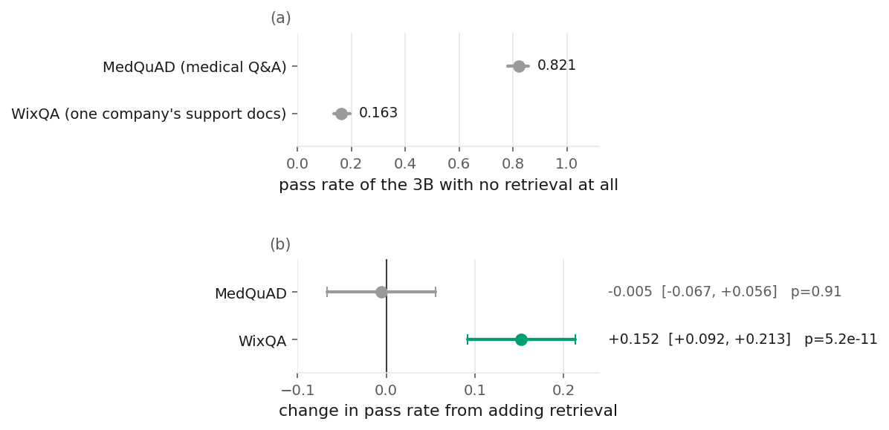
</picture>

**Yes: 0.163 → 0.315, a difference of +0.152 [+0.092, +0.213], p = 5×10⁻¹¹.** Per-seed deltas are
tight and all positive: +0.160, +0.130, +0.165.

The unaided baseline is the number to notice first. **0.163**, against 0.821 on MedQuAD — and not one
answer in 600 was rated complete. The gap this testbed was chosen for is real and large.

#### The lift is the retrieved data, demonstrably

<picture>
  <source media="(prefers-color-scheme: dark)" srcset="../reports/figures/fig-10-wixqa-rag-gold-split-dark.png">
  
</picture>

Hold the model, prompt, judge and pass bar fixed. Split the same run by one property — whether the
article containing the answer actually appeared in the retrieved top three:

| | without retrieval | with retrieval | difference |
|---|---|---|---|
| the answer's article **was** retrieved (110 questions) | 0.127 | 0.400 | **+0.273** |
| it **was not** (90 questions) | 0.207 | 0.211 | +0.004 |

Nothing differs between those two rows except whether the retrieved text contained the answer. This is
a within-run contrast, so it is not vulnerable to anything that differs between the two testbeds.

The aggregate +0.152 decomposes into those two regimes at a 55% hit rate: 0.55 × (+0.273) + 0.45 × (+0.004)
reproduces it exactly.

**Sources:** `runs/rag-wixqa/1-no-rag/`, `runs/rag-wixqa/2-rag-basic/` and the retrieval log beside
them. Dataset: WixQA [[22](#references)], MIT.

#### What it means

**The law, in one sentence: retrieval helps if and only if the retrieved text contains the answer.**
That sounds tautological and is not — it makes a testable prediction about what to spend effort on,
which Study 5 tests. It also explains Study 2 without needing a second mechanism: on a domain the
model already knows, the retrieved text rarely contains anything it needs.

---

### 7.5 Study 5 — what actually gates retrieval?

**Table 9.** [*WixQA Retriever Comparison*](../reports/tables/tab-09-wixqa-retriever-comparison.md) ·
**Table 10.** [*WixQA Grounding Window Results*](../reports/tables/tab-10-wixqa-grounding-window-results.md)
· **Protocols:** [retriever gate](protocol/2026-07-24-wixqa-retriever-gate.md) ·
[dose-response run](protocol/2026-07-25-wixqa-dose-response-run.md)

#### The question

If the law from Study 4 holds, then raising the hit rate should raise the pass rate along a
predictable path, and the payoff *given* a correct retrieval should stay put. Does it?

#### What was measured

Seven retriever variants compared offline on hit rate — no model calls, so the whole ladder costs
minutes rather than GPU-days. The winner then run end-to-end at 3 seeds, with everything except the
retriever held byte-identical.

#### Result — the dose-response

<picture>
  <source media="(prefers-color-scheme: dark)" srcset="../reports/figures/fig-12-wixqa-retrieval-dose-response-dark.png">
  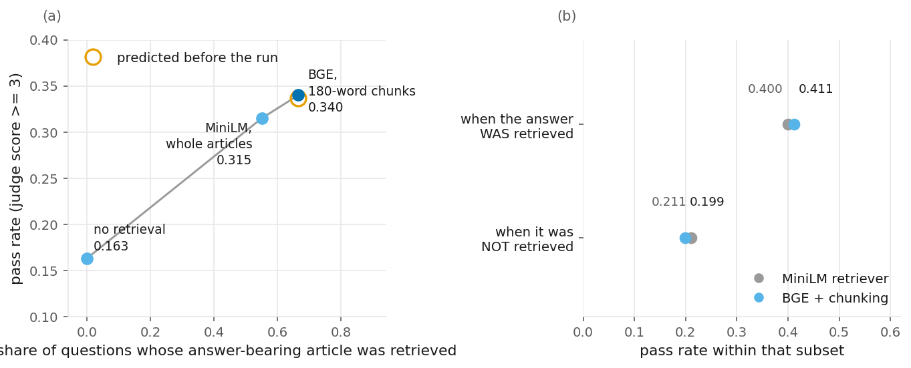
</picture>

The winner raised hit rate **0.550 → 0.665**. Chunking articles before embedding mattered more
(+0.095) than a stronger encoder (+0.070), for a reason visible in the corpus itself:

<picture>
  <source media="(prefers-color-scheme: dark)" srcset="../reports/figures/fig-13-wixqa-article-length-distribution-dark.png">
  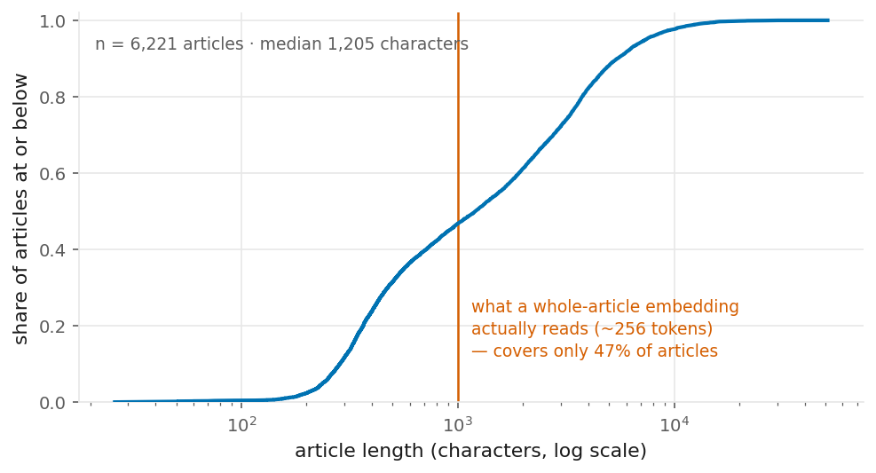
</picture>

The encoder reads roughly the first 256 tokens, so for most of this corpus a whole-article vector
describes an introduction.

**The prediction held.** Before running the upgraded retriever end-to-end, its pass rate was predicted
at **0.337** from a mixture of the two conditional rates measured on the previous rung. The run
returned **0.340**. And P(pass | answer retrieved) stayed pinned at 0.400 → 0.411: the retriever
changes how *often* the answer is found, not what it is worth once found.

Honest caveat: the aggregate retriever gain is **+0.025 [−0.028, +0.080], p = 0.27** and is *not*
significant. The evidence for the mechanism is the invariance and the accuracy of the prediction, not
the size of the jump. The offline ladder also produced three negatives worth keeping: keyword search
alone scored well below the dense baseline, fusing the two dragged the strong retriever down, and a
cross-encoder rerank helped at k=5 and k=10 while costing precision at k=3, which is the k in use.

**Sources:** `reports/rag-wixqa/retriever-hitrate.json` · `runs/rag-wixqa/3-rag-better-retriever/`.
Encoder: BGE [[13](#references)]. The position effect that motivates chunk-centring is Lost in the
Middle [[9](#references)].

#### The largest single win was not the retriever

An audit before the next experiment asked a question nobody had: when the right article *is* retrieved,
does the answer actually reach the prompt? It did not. The system showed the first 900 characters of
each article, and the median article is 3,555 characters — so **92.7% were cut, the model saw about a
quarter of the article, and 41% of the expert answer's content survived** against a ceiling of 72%.

<picture>
  <source media="(prefers-color-scheme: dark)" srcset="../reports/figures/fig-15-wixqa-grounding-window-coverage-dark.png">
  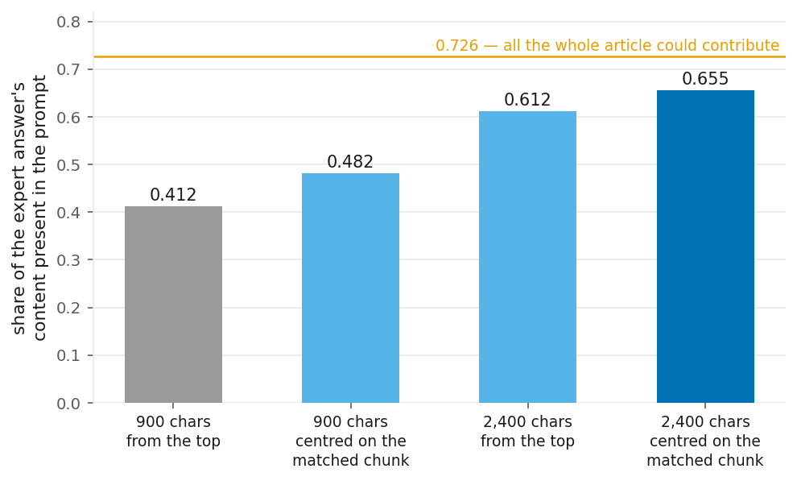
</picture>

Centring the same window on the chunk the retriever had already matched — using localisation the
system was computing and discarding — costs 7% more prompt and recovers seven points of coverage. The
widest centred window reaches 90% of what the full article could possibly contribute.

Holding retrieval byte-identical and changing only which text reached the prompt:

**pass rate 0.340 → 0.470, +0.130 [+0.072, +0.188], p = 3.5×10⁻⁸.**

Five times the retriever's effect, and it buys no extra model call — but it is not free. The mean
grounding block grows from 2,640 to 6,175 characters ([`context-window-coverage.json`](../reports/rag-wixqa/context-window-coverage.json)), roughly
2.3 times the context the model must read on every question. Answers nonetheless got *shorter* —
152 to 144 words — so this is better selection of facts, not more text. And the supposed "0.400 model ceiling"
rose to 0.534, so it was never a model ceiling.

This is the exploratory finding flagged in §2.1. It was not what the study was designed to measure.

**Sources:** `reports/rag-wixqa/context-window-coverage.json` · `runs/rag-wixqa/4-rag-wider-context/`
· `reports/rag-wixqa/wider-context-vs-narrow.txt`.

#### Fixing two stages exposed a third

<picture>
  <source media="(prefers-color-scheme: dark)" srcset="../reports/figures/fig-14-rag-pipeline-stage-analysis-dark.png">
  
</picture>

Retrieval resolves into three stages that can be measured separately: is the answer-bearing document
**found**, does its answer text **reach the prompt**, and does the model **use** what it was shown.
The first two were improved. With nearly twice as much answer material in front of it, the model used
a smaller share of it: **88% → 61%.** Roughly two fifths of what it is shown goes unused.

That is the remaining bottleneck, and it is not a retrieval problem. Note also that "extraction" is a
derived ratio rather than an observed quantity, and inherits the noise of both its parts (§10).

---

### 7.6 Study 6 — does the loop compound with retrieval?

**Table 12.** [*WixQA Loop Plus RAG Results*](../reports/tables/tab-12-wixqa-loop-plus-rag-results.md)
— 133 gold-retrieved questions, **one seed — directional** ·
**Protocol:** [grounding-and-loop plan](protocol/2026-07-25-wixqa-grounding-and-loop-plan.md)

#### The question

This is the system the project is named after: the loop and retrieval together. Study 1 showed
self-refinement is worth +0.091 on its own; Study 4 showed retrieval is worth +0.152 where a gap
exists. Do they add?

The design is the honest version: grounding persists through every refinement round rather than only
the first, the number of rounds is fixed rather than gated on the judge, and the teacher stays dead
because Study 1 settled that.

#### Result

**They do not compound.**

<picture>
  <source media="(prefers-color-scheme: dark)" srcset="../reports/figures/fig-16-wixqa-self-refine-by-prior-score-dark.png">
  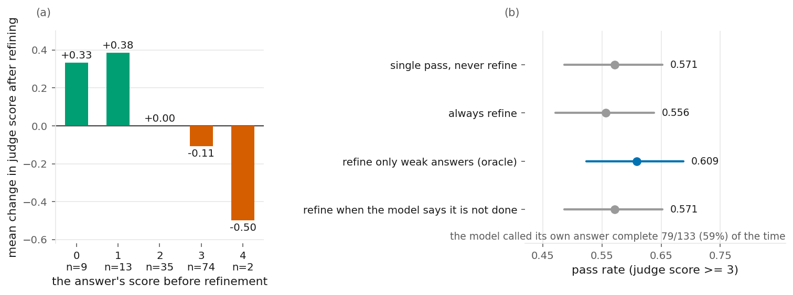
</picture>

Mechanically it works — reference coverage rises **+0.031 [+0.018, +0.047]**, an interval excluding
zero, and 62% of answers are edited. But the judged bar does not move: **−0.015 [−0.068, +0.038]**,
p = 0.77. Making an answer contain more of the right material is not the same as making it correct.

The reason is the tug-of-war again, now for iteration: refinement lifts answers that scored 0 or 1
(+0.33, +0.38) and taxes those that scored 3 (−0.11, with seven made worse and none improved). 57%
were already at 3.

**And the gate is the missing piece, for the third time.** Refining only the weak answers would be
worth +0.038. The implementable version — asking the model whether it is done — captures **none** of
it: the 3B called its own answer complete **79 times out of 133**, including when it was wrong.

That is the same conclusion Study 2 reached about selective retrieval and Study 3 reached about
reliability, on different interventions, a different testbed, and months apart.

**Source:** `runs/rag-wixqa/pilots/5-rag-plus-self-refine/`, paired against the seed-42 gold-retrieved
slice of `runs/rag-wixqa/4-rag-wider-context/`.

#### Why this study is single-seed

Because a rule written before it ran said so (§2.2). The pilot returned a flat result with an interval
spanning zero, which is the row that licensed stopping. Running the three seeds anyway would have been
the more comfortable choice and is exactly what the rule existed to prevent.

---

### 7.7 Study 7 — does fine-tuning help?

**Table 13.** [*MedQuAD LoRA Results*](../reports/tables/tab-13-medquad-lora-results.md) — every value
· **Evidence:** [`reports/lora-medquad/`](../reports/lora-medquad/)

#### The question

Fine-tuning on the domain's own answers is the third widely-assumed route. Does it help?

#### What was measured

A QLoRA fine-tune, 4-bit, rank 16 on attention and MLP projections, 2 epochs over the 506 training
pairs, 23 minutes on an 8 GB laptop GPU. Evaluated on the same 125 held-out questions with the adapter
switched on and off on an identical inference stack, 2 seeds, so the difference isolates the adapter.

There is **no protocol** for this study, and that is recorded rather than hidden: the planned recipe —
generating training data with the loop — produced no usable signal at its smoke test, and was replaced
with standard supervised fine-tuning on the reference answers. The change is in the decision log.

#### Result

<picture>
  <source media="(prefers-color-scheme: dark)" srcset="../reports/figures/fig-17-medquad-lora-effect-dark.png">
  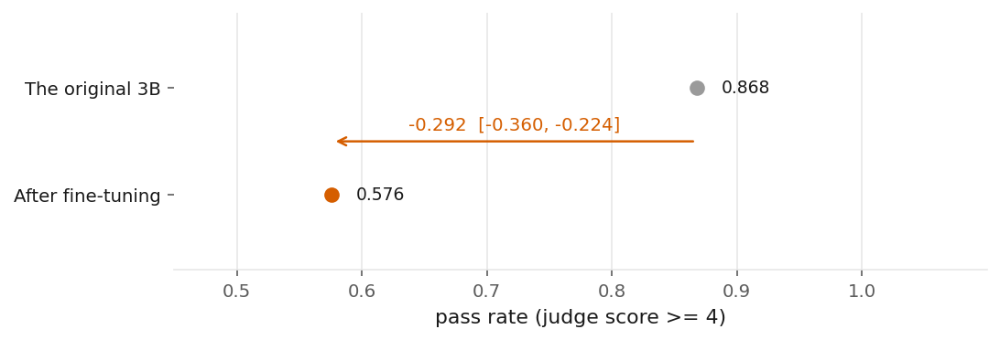
</picture>

**No: 0.868 → 0.576, a difference of −0.292 [−0.360, −0.224].**

Training was healthy — loss 1.98 → 0.99, token accuracy 0.59 → 0.75. **The fine-tune worked, and that
is why it hurt.** It learned the reference corpus's terse house style, answers became 30–45% shorter,
and shorter answers fail a bar that requires completeness. The objective it was trained on and the
objective it was scored on were not the same one — the alignment tax [[16](#references)] and
catastrophic forgetting during continual fine-tuning [[15](#references)], measured on a laptop.

The effect is not uniformly bad — the terser adapter occasionally lands a concrete figure where the
base model hedges — but the aggregate is a large, clear negative.

**Source:** `reports/lora-medquad/fine-tuned-vs-original.json`. The base rate here (0.868) differs
slightly from the 0.821 measured elsewhere because this evaluation ran on the HuggingFace stack rather
than Ollama, which is precisely why the comparison is made *within* one stack.

---

### 7.8 The system answering live

**Table 11.** [*Demo Worked Examples*](../reports/tables/tab-11-demo-worked-examples.md) — the same
questions three ways

Four questions run through the local 3B with no retrieval, with retrieval and a narrow window, and
with retrieval and the wider centred window. The set deliberately includes a question whose
answer-bearing article was *not* retrieved, and it gets worse rather than better — the tug-of-war
showing up in four examples instead of 600 cells.

---

## 8. General discussion

### 8.1 The law, and the pipeline underneath it

Retrieval helps if and only if the retrieved text contains the answer. Stated that way it sounds
circular; measured, it decomposes into three stages that fail independently and are worth fixing in a
different order than intuition suggests.

| stage | question | before | after | lever |
|---|---|---|---|---|
| **retrieval** | is the answer-bearing document found? | 0.550 | 0.665 | chunk before embedding, stronger encoder |
| **delivery** | does its answer text reach the prompt? | 0.412 | 0.655 | centre the window on the matched chunk |
| **extraction** | does the model use what it was shown? | 0.880 | **0.610** | unsolved |

The ordering matters for anyone building this. **Delivery was worth five times the retriever, at no
inference cost**, and it was invisible until someone asked whether a correct retrieval was actually
reaching the model. The third stage got worse as the first two improved, which is what a real
bottleneck looks like when you move it.

### 8.2 One pattern, three independent replications

The same shape appeared in three studies that had no reason to agree:

| | intervention | helps | hurts | oracle gain | implementable gate |
|---|---|---|---|---|---|
| §7.2 | retrieval on MedQuAD | questions never answered right | questions always answered right | +0.099 | none worked |
| §7.3 | retrieval, measured on dependability | the genuine gaps | everything else | — | — |
| §7.6 | self-refinement on top of retrieval | answers scoring 0–1 | answers scoring 3 | +0.038 | captured 0.000 |

Every intervention in this report is worth having **selectively** and costly when applied always. And
in every case the gate that would select is the part that does not exist: the 3B cannot tell when it
needs help, calling its own answer complete 59% of the time including when it was wrong.

A finding that replicates across experiments with no reason to agree is the strongest thing in this
report. It is also the clearest direction for further work: the unsolved problem is not a better
intervention, it is a reliable gate.

### 8.3 Against the literature

**Table 14.** [*Literature Comparison*](../reports/tables/tab-14-literature-comparison.md) — fifteen
works and what happened when each was measured here

Taking §4's predictions in order.

**Confirmed.** Retrieval beats fine-tuning for injecting knowledge [[2](#references)] — sharply:
+0.152 against −0.292. The superficial alignment hypothesis [[3](#references)] is supported painfully;
the fine-tune transferred style exactly as predicted, and that is what broke it. Adaptive retrieval
[[6](#references)], distraction by irrelevant context [[7](#references), [8](#references)], and
position within the context window [[9](#references)] all reproduce. So does miscalibration
[[10](#references), [11](#references)] — the failed gates of §7.2 and §7.6 are that literature
measured.

**Did not transfer.** Self-Refine [[4](#references)] held on a saturated domain (+0.091) but did
**not** transfer on top of retrieval at 3B scale (−0.015). That is consistent with Huang et al.
[[5](#references)], which predicts exactly this failure when the model must supply its own correctness
signal — and the 59% false "complete" rate is that paper's mechanism, measured. The two works are not
in conflict; the boundary between them is the model's ability to judge its own output, and this report
locates that boundary at 3B on a grounded task.

**Method.** The statistics follow standard practice: Wilson score intervals for a proportion
[[25](#references)], the exact paired test for a difference [[26](#references)], and a cluster
bootstrap over questions [[27](#references)].

---

## 9. Implications for building

1. **Measure the no-retrieval baseline before building an index.** It is the cheapest measurement in
   this report and it predicts whether retrieval can pay at all. 0.821 versus 0.163 is the whole
   difference between a null and +0.152.
2. **Spend the first effort on delivery, not the retriever.** Which text reaches the prompt was worth
   five times a better retriever here, and it needs no extra model call — only a larger grounding
   block (2,640 → 6,175 characters), which is the cheapest currency you have. Ground on the passage
   the retriever matched, not the top of the document.
3. **Do not ship always-on self-refinement.** Roughly three times the inference cost for no measurable
   gain, and it damages answers that were already correct.
4. **Do not fine-tune on reference answers to add knowledge.** It transfers style, and the style may
   fight your evaluation.
5. **The unsolved problem is a gate.** Three independent measurements say the same thing: these
   interventions are worth having *selectively*, and a 3B cannot decide for itself when to apply them.
   That is where the next real gain is.
6. **Target "correct", not "expert-complete", for a small model.** On WixQA the strict bar was
   structurally unreachable — the full source article contains only about 72% of the expert answer.
7. **It runs on one laptop for nothing.** The model, the index and the fine-tune are all local; only
   the judge — the measuring instrument, not the product — used a hosted API.

---

## 10. Limitations

- **Three judge configurations scored this report, and none is calibrated.** The MedQuAD studies use a
  *blind* judge that sees only the question and the answer — and they do not all use the same one:
  every study except the reliability sweep uses the hosted `llama-3.1-8b-instant`, while that sweep
  (§7.3) used the local `llama3.1:8b`, the more permissive of the two. Both candidates for the blind
  role failed their calibration probe (**Table 17**,
  [*Judge Calibration Probes*](../reports/tables/tab-17-judge-calibration-probes.md)), and no better
  independent option existed within the free-tier constraints, so the pass bar was raised instead
  and one judge was held fixed across every arm. The WixQA studies use a second, *reference-comparing*
  judge ([`scripts/wixqa/judge.py`](../scripts/wixqa/judge.py) with the rubric in
  [`src/tlw/wixqa/prompts.py`](../src/tlw/wixqa/prompts.py)), which is a different prompt in a
  different mode and **was never probed at all** — it inherits none of the blind judge's evidence.
  Comparisons *within* a testbed use one fixed judge throughout and remain valid on that basis;
  absolute pass rates carry less weight than the differences, and a pass rate from one testbed should
  not be read against a pass rate from the other.
- **One seed for Study 6.** A pre-registered stop rule ended it when the pilot came back flat, so those
  numbers are directional and labelled as such everywhere.
- **The three rescue attempts in Study 2 are single-seed** and shown in a lighter colour for that
  reason.
- **Study 3's set was selected on prior failure**, so only the difference between arms is
  interpretable, and it will regress toward the mean on its own.
- **Two of the three testbed-level findings rest on one dataset each.** MedQuAD and WixQA differ in more
  than the knowledge gap; the gold-split *within* a single run is what makes the causal claim, not the
  comparison between them.
- **Pre-registration dates are not corroborated by version control** (§2.3). What is checkable is that
  two recorded predictions were wrong and one stop rule cost a result.
- **Five of six pre-registered numeric predictions landed outside their stated range**, and this
  report said "two" until an external review counted them. The two it named — the grounding repair
  predicted at ~0.36 that returned 0.470, and refinement predicted at +3 points that returned −1.5 —
  are the two where the mechanism story survived being wrong. The three it omitted are the two
  *completeness*-bar predictions, both of which came in far **below** their floor (0.007 against a
  0.01–0.06 range, and 0.008 against 0.02–0.11), and one more that overshot. Nothing was concealed:
  every one of those outcomes is published in Tables 10, 12 and 15. What was favourable was the
  scorecard, in the one table that exists to make being wrong visible — so
  [Table 16](../reports/tables/tab-16-predictions-vs-outcomes.md) now scores all six against the runs
  instead of listing them by hand, and the count in its note is computed rather than written. The
  misses that matter share one cause: an observational correlation was trusted that a controlled
  comparison later contradicted.
- **"Extraction" is a derived ratio**, not a directly observed quantity, and inherits the noise of both
  its parts.
- **No correction was applied for testing many comparisons.** This report states twenty-six
  confidence intervals, and the tables behind it carry more, each at the conventional 95% level.
  Across that many comparisons some would be expected to exclude zero by chance alone. Three things
  limit what that costs here, and none of them removes it. First, the primary comparison in each
  study was named in its protocol before the run rather than chosen afterwards, so the headline
  results are not the survivors of a search. Second, the effects that carry the argument are large
  relative to their intervals — +0.152, +0.130 and −0.292 would survive any reasonable correction.
  Third, most of what was measured came back null and is reported that way
  (**Table 15**, [*Null Results*](../reports/tables/tab-15-null-results.md), twenty-six entries),
  which is the opposite of the pattern selective reporting produces. The estimates most exposed are
  the small secondary ones — the retriever's +0.025 in Study 5 — and those are already described as
  not significant on their own.
- **Statistical significance is not effect size, and neither is practical value.** A result can clear
  an interval and still be too small to matter to a product; §9 argues from the sizes, not the
  p-values.
---

## 11. What broke in the project itself

**Table 19.** [*Methodology and Integrity*](../reports/tables/tab-19-methodology-and-integrity.md) —
the guardrails, including the ones that caught something

A guardrail nobody has ever tripped is untested. Eleven fired. Seven are worth naming here because they
are defects in the project's *own* credibility rather than in a result:

- **The results could not be reproduced from a clone.** Thirteen scripts hardcoded an absolute path
  into one developer's home directory — including every script behind the retrieval findings.
  Discovered by a structure audit *after* all the results were in.
- **A wrong comparator reversed a study's conclusion.** The loop-plus-retrieval effect rendered as
  +0.045 — "the loop compounds" — because it was paired against a similarly-named earlier pilot. The
  correct value is −0.015. Caught by looking at the rendered figure and noticing it disagreed with the
  report.
- **A third of the evidence was reported as all of it.** A diagnostic returned the first run it found
  instead of aggregating seeds; because run directories sort lexically, that was seed 123 alone.
- **The more damning of two calibration probes was silently dropped**, because the two candidates were
  probed by different script versions writing different key names.
- **A headline was quietly wrong for one command** — pointing the analysis at the whole runs directory
  pooled fourteen pilot runs into the loop ablation.
- **The project was still advertising its own retracted result** on the third line of its README.

Each is now closed structurally rather than by remembering: paths made relative and validated by
tests, pilots moved where the discovery function cannot reach them, named regression tests on the
comparator and the aggregation, and a function that refuses to return if it finds fewer than two
calibration candidates.

- **An agent's "there is nothing there" was repeated without being checked.** An automated audit
  reported that the project's original notebook held no prose worth keeping, and that conclusion was
  passed on without the file being opened. It held twenty-four cells of design rationale, including
  the clearest surviving account of *why* the leakage looked reasonable when it was written. The
  notebook had already been deleted; the prose was recovered verbatim from git history and published
  as [an appendix](archive/v1-notebook-narrative.md). Nothing measured changed, but the project came
  within one commit of discarding the best explanation of its own central mistake.

**One near-miss is worth more than the seven.** During a repository restructure, an audit recommended
deleting a run directory on the grounds that nothing referenced it by name. An independent
pre-execution check found that a published table was recomputed from exactly those files, and the
deletion was cancelled. *"No references to the directory name" is not the same as "no published number
depends on its contents"* — the check that caught it existed only because the restructure was required
to verify before it destroyed.

---

## 12. How the work was governed

### 12.1 How decisions were made

Decisions were made in a planning conversation and executed separately, with each durable decision
written into an append-only log before the work that depended on it. That log is
[Table 20](../reports/tables/tab-20-decision-log.md) — thirty-six entries, each with its date and
status. An accepted entry is never edited; it is superseded by a later one that says why. So a
contradiction between two entries is a record of a mind changed by evidence, not an inconsistency.

Before any code was written for the rebuild, a gate review framed seven open questions with a
recommendation for each, and all seven were resolved in one sitting. Three of them changed the
design rather than confirming it:

- **the student model** — a 7B was chosen for the pilot, and the measurement later moved to a 3B when
  the pilot showed the 7B had no headroom left at the original bar;
- **judging mode** — blind-only, with reference-similarity demoted to a diagnostic that can never
  gate a pass. That single decision is what made §7.1's central observation visible;
- **memory** — off in every headline arm, so that the loop comparison could not be confounded by
  what an earlier question had stored.

An audit of the working environment at the same time found three competencies unowned and two holes in
the enforcement tooling; statistics was folded into an existing role rather than adding one, and the
holes were closed.

### 12.2 Where the working documents went

Fifty-one task specifications and design notes sat under `docs/plan/`, roughly 41% of all prose in
this repository. Most were instructions to an executor: *objective, read first, steps, definition of
done*. They are no longer published, and the material worth keeping is where a reader would look for
it:

| working document | where its substance is now |
|---|---|
| the two evaluation protocols, the three WixQA plans | [`docs/protocol/`](protocol/README.md), unchanged and dated |
| the pilot report, the selective-gating analysis | [`reports/teaching-loop-medquad/`](../reports/teaching-loop-medquad/) · [`reports/rag-medquad/`](../reports/rag-medquad/) |
| the prompt catalogue | §5.4 |
| the structure proposal | §5.3 and §11 |
| the migration checklist | §11, the near-miss |
| the gate review | §12.1 |
| the environment audit | §12.1, one sentence |
| the leakage census | [`docs/LEAKAGE_AUDIT.md`](LEAKAGE_AUDIT.md), rewritten as a document |
| the thirty-nine remaining task specifications | not published |

### 12.3 And the five per-study reports

Until this revision, each study also had its own document — `TRACK_A_RESULTS.md`,
`RAG_RESULTS.md`, `WIXQA_RESULTS.md`, `PRODUCT_RESULTS.md`, `RAG_RELIABILITY_ANALYSIS.md`. They are
now §7 of this one.

They were merged rather than kept because they were not appendices: each carried its own method,
results and discussion, which is the shape of a study inside a multi-study report rather than a
supplement to one. Keeping them alongside §7 would have meant every headline number living in two
places, which is the failure this project spent a chapter documenting.

| study report | now |
|---|---|
| `TRACK_A_RESULTS.md` | §7.1 |
| `RAG_RESULTS.md` | §7.2 |
| `RAG_RELIABILITY_ANALYSIS.md` | §7.3 |
| `WIXQA_RESULTS.md` | §7.4, §7.5, §7.6 |
| `PRODUCT_RESULTS.md` | §7.7 |

What did *not* merge is the operating detail — the exact commands, per-run call counts, judge
fallback rates. That is evidence rather than narrative, and it lives in
[`reports/`](../reports/README.md), one directory per study, each carrying the command that
regenerates it.

### 12.4 Nothing was deleted

The full text of every document named in §12.2 and §12.3, as it stood before this change, is in
version control at commit `64a39cc372a3`:

```bash
git show 64a39cc372a3:docs/plan/PROMPT_CATALOG.md
git show 64a39cc372a3:docs/TRACK_A_RESULTS.md
```

That command is given because twelve of these documents are cited as evidence inside accepted
decisions in the log, and an accepted decision cannot be edited to point somewhere new. The two
tables above and this commit are how those citations resolve.

---

## 13. Reproduction and appendices

Nothing below needs a GPU, an API key, or a model run. Every number comes from committed logs.

```bash
python scripts/make_figures.py
```

Regenerates all 17 figures (light and dark) and all 21 tables from `runs/`, `reports/` and
`logs/experiments/`.

```bash
python -m pytest tests/ -q
```

473 tests, including `tests/tlw/figures/`, which recomputes each published headline from its
artifact and fails if a figure and a document disagree.

```bash
python -m src.tlw.analysis --runs-dir runs/teaching-loop-medquad --comparison C-B --comparison B-A
python -m src.tlw.analysis --runs-dir runs/rag-medquad --rag
python scripts/wixqa/analyze_three_seeds.py
python scripts/wixqa/analyze_dose_response.py
```

The original analyses, run directly. Each study directory under `reports/` carries the exact command
that regenerates its own report as the first two lines of the file.

**To rebuild the logs themselves** rather than recompute from them — the model runs, the index
builds, the judging, the fine-tune — see
[`reports/HOW_TO_REGENERATE.md`](../reports/HOW_TO_REGENERATE.md). That layer needs a GPU for one
step and a hosted judge for another; nothing in this report does.

### Appendices

| | |
|---|---|
| **A** | [Leakage audit](LEAKAGE_AUDIT.md) — the eighteen paths, the derivation of the 70% figure, and how a leak propagated |
| **B** | [Protocols](protocol/README.md) — what was decided before each study ran, with a register of what the dates can and cannot prove |
| **C** | [Figures](../reports/figures/README.md) — all 17 with their captions |
| **D** | [Tables](../reports/tables/) — all 21, every measured value including the nulls |
| **E** | [Evidence](../reports/README.md) — the committed analysis outputs behind every number |
| **F** | [Decision log](../.claude/rules/decisions.md) — all thirty-six, in full |
| **G** | [The retired write-up](archive/PROJECT_OVERVIEW_AND_RESULTS.md), with a banner naming each false claim · [the original design rationale, recovered verbatim](archive/v1-notebook-narrative.md) |

---

## 14. Contribution and tool use

### 14.1 Who did what

This is single-author work. Phakphoom Deesuwan is the sole contributor and holds every role in the
CRediT taxonomy [[34](#references)] that applies: conceptualisation, methodology, software,
validation, formal analysis, investigation, data curation, writing, visualisation, and project
administration. The taxonomy is normally used to divide credit between people; stating it for one
person is worth the two lines because it also states where responsibility sits — including for the
errors in §11, none of which are attributable to anyone else.

The work ran from **2025-11-25 to 2026-08-09**, in two phases separated by the audit. The original
system was built and run in November 2025; it was audited on 2026-07-10, and the rebuild that
retracted and replaced it ran from then to August 2026
(**Table 21**, [*Project Timeline*](../reports/tables/tab-21-project-timeline.md), dated from run
logs and the decision record rather than from memory). The repository's main line of development
carries 35 commits; 50 exist across all branches, including the preserved pre-audit history.

No funding, no institutional review, and no human participants. There are no competing interests to
declare.

### 14.2 How AI tooling was used

I designed and ran this study. An AI coding assistant (Anthropic's Claude, used through Claude Code)
did a large share of the typing, the searching and the routine analysis, working to instructions I
set and under constraints I wrote down before the work started. Disclosing that is now standard
practice for scholarly work [[33](#references)], and the useful form of the disclosure is not "AI was
used" but *which content, which action, which oversight*. So:

| Where | What the assistant did | What I did |
|---|---|---|
| **Code** | wrote most of `src/`, `scripts/`, `tools/` and the tests to a specification | set the architecture (six configurable slots, one registry per seam), reviewed every module, and rejected the ones that did not fit it |
| **Experiments** | executed the runs, collected the logs, computed the statistics | chose the questions, the arms, the seeds and the stopping rules — before each run, in the protocols in [`docs/protocol/`](protocol/README.md) |
| **Analysis** | recomputed every published figure and table from the logs | decided what counted as the headline statistic, and what counted as a null |
| **Writing** | drafted this report and the README from the results and the decision log | set the structure and the argument, verified every number against its source, and wrote the judgements |
| **The models under test** | — | Qwen2.5 (3B and 7B) and Llama 3.1 8B are the *subjects* of the experiments, not tools that helped run them; they never saw a reference answer on any measured path (§5.6) |

**The constraints came first, and they are checkable.** Before the rebuild started — and in direct
response to what the audit had just found — I wrote six rules: numbers must match their source log;
the reference answer never reaches the student or the scorer; every run is seeded and reproducible
from one command; every claim cites a file or a command; the interpreter is pinned; and an accepted
decision cannot be quietly edited. They live in
[`.claude/rules/00-index.md`](../.claude/rules/00-index.md) §0.

Two of them are enforced by machinery rather than by anyone remembering. A pre-execution hook
([`.claude/hooks/guard.py`](../.claude/hooks/guard.py)) refuses any command that would run an
unpinned interpreter or write into the raw data and the experiment logs; the assistant cannot
proceed past it, and the block cites the rule it enforced. The leakage rule is enforced inside the
code itself, by a guard that aborts a run rather than warning about it — and it has fired on a real
echo (§5.6). The rest are enforced by tests. That is the difference between directing a tool and
being carried by one: the rules were written before the work they govern, they are adversarial to
the result rather than convenient for it, and the tool was not free to ignore them.

**Three decisions were mine, went against what the tooling proposed, and changed the result.**

1. **An audit recommended deleting two run directories on the grounds that nothing referenced them
   by name.** I checked what depended on their *contents* rather than their name and found that a
   published reliability table was recomputed directly from them. Deleting them would have stripped
   the evidence out from under a number that is still cited. Both were kept and merely relocated;
   the decision is recorded as an amendment to
   [`.claude/rules/decisions.md`](../.claude/rules/decisions.md), ADR-034, clause 5. "No references
   to this name" is not the same claim as "no published number depends on this data."
2. **The plan called for a narrative notebook as the final deliverable. I cancelled it** and wrote
   two documents instead — this one and the README. A notebook has to be executed before it can be
   read, GitHub renders Markdown immediately, and a third telling of the same results is a third
   place for the numbers to disagree with each other. ADR-036.
3. **The project's own scope had drifted, and I corrected it before the write-up.** Every retrieval
   run up to that point had been single-pass; the loop had only ever been measured *without*
   retrieval. The system this project is about is the two together, and it had never been run. That
   became Study 6 — which returned a null, and is reported as one. ADR-032.

**And one place where the tooling failed, which is the most useful thing in this section.** An
automated audit reported that the old notebook contained "no prose worth salvaging," and I repeated
that conclusion without opening the file. It was wrong: the notebook held twenty-four cells of design
rationale, including the clearest surviving explanation of *why* the leakage looked reasonable at the
time it was written. It was recovered verbatim from git history and is published as
[an appendix](archive/v1-notebook-narrative.md). The lesson generalises past this project, and it is
the same discipline the rest of the report runs on: an agent reporting "there is nothing there" is a
claim to be verified, not a result to be repeated. Section 11 exists because that discipline
occasionally failed, and §11 is the list of what it cost.

---

## References

Numbered as cited above. The same list, annotated with what each work claims and what happened when it
was measured here, is generated into
[Table 14](../reports/tables/tab-14-literature-comparison.md) from a single source in
`src/tlw/figures/data.py`, so the two cannot disagree — and a test asserts every work cited in this
report appears there.

1. Lewis, P., Perez, E., Piktus, A., et al. (2020). *Retrieval-Augmented Generation for Knowledge-Intensive NLP Tasks*. NeurIPS 2020. arXiv:2005.11401.
2. Ovadia, O., Brief, M., Mishaeli, M., Elisha, O. (2024). *Fine-Tuning or Retrieval? Comparing Knowledge Injection in LLMs*. EMNLP 2024. arXiv:2312.05934.
3. Zhou, C., Liu, P., Xu, P., et al. (2023). *LIMA: Less Is More for Alignment*. NeurIPS 2023. arXiv:2305.11206.
4. Madaan, A., Tandon, N., Gupta, P., et al. (2023). *Self-Refine: Iterative Refinement with Self-Feedback*. NeurIPS 2023. arXiv:2303.17651.
5. Huang, J., Chen, X., Mishra, S., et al. (2024). *Large Language Models Cannot Self-Correct Reasoning Yet*. ICLR 2024. arXiv:2310.01798.
6. Mallen, A., Asai, A., Zhong, V., et al. (2023). *When Not to Trust Language Models: Investigating Effectiveness of Parametric and Non-Parametric Memories*. ACL 2023. arXiv:2212.10511.
7. Cuconasu, F., Trappolini, G., Siciliano, F., et al. (2024). *The Power of Noise: Redefining Retrieval for RAG Systems*. SIGIR 2024. arXiv:2401.14887.
8. Shi, F., Chen, X., Misra, K., et al. (2023). *Large Language Models Can Be Easily Distracted by Irrelevant Context*. ICML 2023. arXiv:2302.00093.
9. Liu, N. F., Lin, K., Hewitt, J., et al. (2024). *Lost in the Middle: How Language Models Use Long Contexts*. TACL 2024. arXiv:2307.03172.
10. Kadavath, S., Conerly, T., Askell, A., et al. (2022). *Language Models (Mostly) Know What They Know*. preprint. arXiv:2207.05221.
11. Xiong, M., Hu, Z., Lu, X., et al. (2024). *Can LLMs Express Their Uncertainty? An Empirical Evaluation of Confidence Elicitation in LLMs*. ICLR 2024. arXiv:2306.13063.
12. Shinn, N., Cassano, F., Berman, E., et al. (2023). *Reflexion: Language Agents with Verbal Reinforcement Learning*. NeurIPS 2023. arXiv:2303.11366.
13. Xiao, S., Liu, Z., Zhang, P., Muennighoff, N. (2023). *C-Pack: Packed Resources For General Chinese Embeddings (BGE)*. preprint. arXiv:2309.07597.
14. Es, S., James, J., Espinosa-Anke, L., Schockaert, S. (2023). *RAGAS: Automated Evaluation of Retrieval Augmented Generation*. preprint. arXiv:2309.15217.
15. Luo, Y., Yang, Z., Meng, F., et al. (2023). *An Empirical Study of Catastrophic Forgetting in LLMs During Continual Fine-tuning*. preprint. arXiv:2308.08747.
16. Ouyang, L., Wu, J., Jiang, X., et al. (2022). *Training Language Models to Follow Instructions with Human Feedback*. NeurIPS 2022. arXiv:2203.02155.
17. Chen, M., Tworek, J., Jun, H., et al. (2021). *Evaluating Large Language Models Trained on Code (pass@k)*. preprint. arXiv:2107.03374.
18. Wang, X., Wei, J., Schuurmans, D., et al. (2023). *Self-Consistency Improves Chain of Thought Reasoning in Language Models*. ICLR 2023. arXiv:2203.11171.
19. Geifman, Y., El-Yaniv, R. (2017). *Selective Classification for Deep Neural Networks*. NeurIPS 2017. arXiv:1705.08500.
20. Kamath, A., Jia, R., Liang, P. (2020). *Selective Question Answering under Domain Shift*. ACL 2020. ACL Anthology 2020.acl-main.503.
21. Ben Abacha, A., Demner-Fushman, D. (2019). *A Question-Entailment Approach to Question Answering (MedQuAD)*. BMC Bioinformatics 20(1):511. doi:10.1186/s12859-019-3119-4.
22. Cohen, D., Shalom, A., et al. (2025). *WixQA: A Multi-Dataset Benchmark for Enterprise Retrieval-Augmented Generation*. preprint. arXiv:2505.08643.
23. Lee, K., Ippolito, D., Nystrom, A., et al. (2022). *Deduplicating Training Data Makes Language Models Better*. ACL 2022. arXiv:2107.06499.
24. Liu, W., Zeng, W., He, K., et al. (2024). *What Makes Good Data for Alignment? A Comprehensive Study of Automatic Data Selection in Instruction Tuning (DEITA)*. ICLR 2024. arXiv:2312.15685.
25. Wilson, E. B. (1927). *Probable Inference, the Law of Succession, and Statistical Inference*. JASA 22(158):209-212. doi:10.2307/2276774.
26. McNemar, Q. (1947). *Note on the Sampling Error of the Difference Between Correlated Proportions or Percentages*. Psychometrika 12(2):153-157. doi:10.1007/BF02295996.
27. Efron, B., Tibshirani, R. J. (1993). *An Introduction to the Bootstrap*. Chapman & Hall. ISBN 978-0412042317.
28. Rougier, N. P., Droettboom, M., Bourne, P. E. (2014). *Ten Simple Rules for Better Figures*. PLOS Computational Biology 10(9). doi:10.1371/journal.pcbi.1003833.
29. Cleveland, W. S., McGill, R. (1984). *Graphical Perception: Theory, Experimentation, and Application to the Development of Graphical Methods*. JASA 79(387):531-554. doi:10.2307/2288400.
30. Appelbaum, M., Cooper, H., Kline, R. B., et al. (2018). *Journal Article Reporting Standards for Quantitative Research in Psychology: The APA Publications and Communications Board Task Force Report*. American Psychologist 73(1):3-25. doi:10.1037/amp0000191.
31. Pineau, J., Vincent-Lamarre, P., Sinha, K., et al. (2021). *Improving Reproducibility in Machine Learning Research (A Report from the NeurIPS 2019 Reproducibility Program)*. JMLR 22(164):1-20. arXiv:2003.12206.
32. Eliasziw, M., Donner, A. (1991). *Application of the McNemar Test to Non-Independent Matched Pair Data*. Statistics in Medicine 10(12):1981-1991. doi:10.1002/sim.4780101211.
33. International Committee of Medical Journal Editors (2023). *Recommendations for the Conduct, Reporting, Editing, and Publication of Scholarly Work in Medical Journals* (§II.A.4, artificial intelligence). <https://www.icmje.org/recommendations/>.
34. Brand, A., Allen, L., Altman, M., Hlava, M., Scott, J. (2015). *Beyond Authorship: Attribution, Contribution, Collaboration, and Credit*. Learned Publishing 28(2):151-155. doi:10.1087/20150211.

---

## Citation

If you refer to this work:

```bibtex
@misc{teaching_lightweight_llms_2026,
  title  = {Teaching Lightweight LLMs: what actually improves a small local model on one domain},
  author = {Deesuwan, Phakphoom},
  year   = {2026},
  note   = {Experiment report: docs/EXPERIMENT_RESULTS.md. All results recomputed from committed
            logs; regenerate with `python scripts/make_figures.py`.}
}
```

**Datasets.** MedQuAD [[21](#references)], CC BY 4.0 — Ben Abacha & Demner-Fushman 2019.
WixQA [[22](#references)], MIT — Cohen et al. 2025. Built with Llama.
